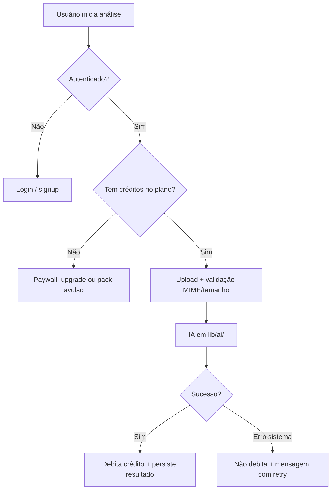

# Planos, Limites e Monetização — Surf Performance & Board AI

> **Versão:** 1.0 · **Base:** [PRD.md](./PRD.md) · **Stack:** Next.js · Supabase · OpenAI (`lib/ai/`)
>
> Estratégia de planos, cotas de uso e implementação técnica para o modelo SaaS. Complementa [SECURITY.md](./SECURITY.md) (anti-abuso) e [PLANO_EXECUCAO.md](./PLANO_EXECUCAO.md) (roadmap de produto).

---

## Visão geral

O produto consome recursos caros por uso:

| Recurso | Impacto no custo |
|---------|------------------|
| IA (visão + texto) | Principal — escala com nº de análises e imagens/frames |
| Storage (vídeos/fotos) | Cresce com retenção e tamanho dos arquivos |
| Processamento | Tempo de fila, timeouts, retries |

**Conclusão:** planos com **limites claros** são obrigatórios. **“Vídeos ilimitados” literal** não é recomendado no MVP nem na V1 — risco de margem negativa e abuso.

---

## Princípios de precificação

1. **Cobrar por créditos de análise**, não só por “vídeos” — o MVP tem três fluxos de IA (performance, prancha mágica, compatibilidade).
2. **Plano grátis enxuto** — suficiente para provar valor (1–2 análises), não para uso contínuo.
3. **Teto alto no plano caro**, não “infinito” — usar *fair use* nos Termos de Uso.
4. **Upsell simples** — pacotes avulsos de créditos para quem não quer assinatura mensal.
5. **Limites técnicos + comerciais** — rate limit (anti-abuso) e cota do plano (monetização) são camadas distintas.

---

## Unidade de cobrança: créditos

Um **crédito** = uma chamada de IA que persiste resultado no banco.

| Tipo de análise | Peso sugerido | Observação |
|-----------------|---------------|------------|
| Performance (vídeo/imagem/link) | **1 crédito** | Mais caro (visão, possíveis múltiplos frames) |
| Prancha mágica (ficha técnica) | **1 crédito** | Várias fotos por análise |
| Compatibilidade de prancha | **1 crédito** | Pode ser 0,5 no futuro; no MVP manter 1 para simplicidade |

**Retry** de análise com erro de sistema: **não debita** crédito.  
**Reanálise voluntária** do mesmo conteúdo: **debita** crédito.

---

## Planos recomendados (V1 comercial)

Valores em BRL são **referência inicial** — validar com custo real de IA + CAC antes do lançamento.

| Plano | Público | Preço/mês | Créditos/mês | Limites adicionais |
|-------|---------|-----------|--------------|-------------------|
| **Grátis** | Trial / primeiro contato | R$ 0 | **2** (total ou/mês¹) | Vídeo até 60 s · 100 MB · 1 prancha mágica |
| **Surfista** | Casual (1–2 sessions/mês) | R$ 39 | **8** | Vídeo até 90 s · histórico 90 dias |
| **Pro** | Filma toda semana | R$ 89 | **30** | Vídeo até 3 min · histórico ilimitado |
| **Coach** | Shaper/coach (futuro) | R$ 199 | **100** | Múltiplos perfis/alunos² · prioridade na fila |

¹ **MVP:** 2 créditos no primeiro mês; após esgotar, paywall.  
² **Fora do MVP** — requer módulo multi-tenant ou “alunos vinculados”.

### Pacotes avulsos (conversão)

| Pacote | Preço | Créditos |
|--------|-------|----------|
| Pack S | R$ 19 | 5 créditos |
| Pack M | R$ 49 | 15 créditos |

Créditos avulsos **não expiram** em 12 meses (definir política nos Termos).

---

## O que evitar

| Abordagem | Problema |
|-----------|----------|
| “1 vídeo”, “3 vídeos”, “5 vídeos” como únicos eixos | Ignora prancha mágica e compatibilidade; confunde o usuário |
| Plano “ilimitado” sem teto | Custo de IA imprevisível; 1 power user pode consumir centenas de análises |
| Só limite diário técnico (ex.: 20/dia) | Não monetiza; power user usa 600/mês de graça |
| Preço fixo sem monitorar custo por análise | Margem negativa quando visão (frames) entrar em produção |

### “Ilimitado” — quando considerar

Somente com:

- Preço alto o suficiente para cobrir p95 de uso (ex.: 50–80 análises/mês).
- **Fair use** nos Termos (ex.: uso pessoal, sem revenda/automação).
- Monitoramento de uso e alertas de anomalia.
- Teto operacional interno (ex.: 200 análises/mês) mesmo no plano “Pro+”.

---

## Limites técnicos atuais (código)

Estado do repositório em 07/2026 — **anti-abuso**, ainda **sem planos comerciais**:

| Limite | Valor | Onde |
|--------|-------|------|
| Análises IA / usuário / dia | 20 | `lib/security/rate-limit.ts` → `rateLimitAiAction` |
| Vídeo (upload) | 100 MB | `services/media-service.ts` |
| Imagem (upload) | 10 MB | `services/media-service.ts` |
| Foto de prancha | 10 MB | `services/board-service.ts` |
| Timeout IA | 90 s | `lib/ai/client.ts` |

Esses valores devem permanecer como **teto de segurança**. A **cota do plano** (créditos/mês) será a regra comercial principal.

---

## Fluxo de uso (produto)



---

## Implementação técnica (roadmap)

### Fase A — MVP monetização mínima

- [ ] Coluna `plan` em `profiles` (`free` | `surfista` | `pro`) ou tabela `subscriptions`
- [ ] Tabela `usage_ledger` (user_id, analysis_type, credits_delta, created_at)
- [ ] Service `usage-service.ts` — `getRemainingCredits`, `debitCredit`, `canStartAnalysis`
- [ ] Substituir checagem única de `rateLimitAiAction` por: **cota do plano** + rate limit como fallback anti-abuso
- [ ] UI: contador “X créditos restantes” no dashboard e paywall ao esgotar

### Fase B — Pagamentos

- [ ] Integração Stripe ou Mercado Pago (assinatura + webhook)
- [ ] Sincronizar status do plano (`active`, `past_due`, `canceled`)
- [ ] Pacotes avulsos (one-time payment → créditos em `usage_ledger`)

### Fase C — Operação

- [ ] Créditos persistidos no Postgres (não só `Map` em memória do rate limit)
- [ ] Job mensal: reset de créditos do plano (cron ou Supabase Edge Function)
- [ ] Dashboard interno: custo médio por análise, uso por plano
- [ ] Alertas quando usuário ultrapassa p95 de consumo

### Schema sugerido (referência)

```
profiles
  plan text default 'free'
  credits_balance int default 0        -- avulsos + sobras
  credits_period_used int default 0    -- consumo no ciclo atual
  billing_period_start timestamptz

usage_ledger
  id uuid
  user_id uuid
  analysis_id uuid nullable
  analysis_type text                   -- performance | board_spec | board_match
  credits_delta int                    -- negativo = consumo, positivo = compra/renovação
  reason text                          -- plan_renewal | pack_purchase | analysis | refund
  created_at timestamptz

subscriptions (Fase B)
  user_id, provider, external_id, status, plan, current_period_end
```

RLS: usuário só lê próprio `usage_ledger` e `subscriptions`.

---

## Projeção de custo (ordem de grandeza)

Para calibrar preços após integração de **visão** (OpenAI `gpt-4o-mini` ou equivalente):

| Cenário | Custo estimado / análise |
|---------|--------------------------|
| Só texto (estado atual do código) | ~R$ 0,01–0,05 |
| 3–5 imagens (prancha) | ~R$ 0,05–0,20 |
| Vídeo com 5–10 frames | ~R$ 0,10–0,40 |

**Exemplo Pro (30 créditos):** custo IA ~R$ 3–12/mês + storage → margem saudável em R$ 89 se uso médio for ~15 análises/mês.

Recalcular após 30 dias de uso real com billing OpenAI ativo.

---

## Provedor de IA e impacto no preço

| Fase | Provedor | Nota |
|------|----------|------|
| MVP | **OpenAI** (`gpt-4o-mini`) | Já integrado; JSON estruturado |
| Otimização | **Gemini Flash** (avaliar depois) | Pode reduzir custo de visão/vídeo |

A troca de provedor **não altera** o modelo de planos — só o custo interno por crédito.

**RAG:** não necessário para monetização nem para o MVP. Contexto do usuário vem do Supabase (perfil, mídia, pranchas).

---

## UX e comunicação

- Mostrar **créditos restantes** antes do upload (evita frustração pós-envio).
- Mensagem clara ao esgotar: *“Você usou suas 8 análises deste mês. Assine o Pro ou compre um pack de 5.”*
- Free tier: CTA após a **primeira análise bem-sucedida** (momento de maior valor percebido).
- Não prometer “ilimitado” na landing — usar “até X análises por mês”.

---

## Checklist antes de cobrar usuários

- [ ] Visão real implementada (imagens/frames enviados ao modelo)
- [ ] Custo médio por análise medido em produção
- [ ] `usage_ledger` + débito atômico com criação de análise
- [ ] Paywall e página de planos
- [ ] Termos de Uso com fair use e política de reembolso
- [ ] Webhook de pagamento testado (upgrade, cancelamento, falha)
- [ ] Rate limit persistido (Redis ou Postgres) em produção multi-instância

---

## Referências

- [PRD.md](./PRD.md) — escopo funcional e métricas de sucesso
- [PLANO_EXECUCAO.md](./PLANO_EXECUCAO.md) — Fase 5 (polish e lançamento)
- [SECURITY.md](./SECURITY.md) — LLM04 (custo/DoS), rate limits
- [state/PENDENCIAS.md](./state/PENDENCIAS.md) — pendências de validação E2E

---

**Última atualização:** 07/07/2026
