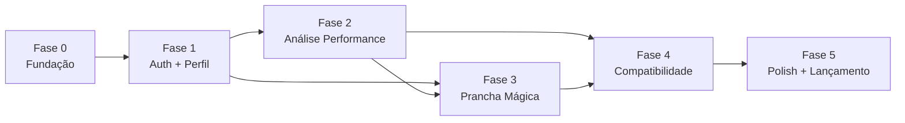

# Plano de Execução por Fases — Surf Performance & Board AI

> **Versão:** 1.0 · **Base:** [PRD.md](./PRD.md) · **Stack:** Next.js (App Router) · Supabase · camada de IA em `lib/ai/`
>
> Plano derivado do PRD, alinhado à arquitetura `UI → Action/Route → Service → Supabase`, camada de IA isolada e aos docs de [Design System](./DESIGN_SYSTEM.md) e [Segurança](./SECURITY.md).

---

## Visão geral das fases



| Fase | Nome | Prioridade PRD | Duração estimada |
|------|------|----------------|------------------|
| 0 | Fundação técnica | — | 1–2 semanas |
| 1 | Auth e perfil | P0 | 1 semana |
| 2 | Análise de performance | P0 | 2–3 semanas |
| 3 | Prancha mágica | P0 | 1,5–2 semanas |
| 4 | Compatibilidade de prancha | P1 | 1–1,5 semana |
| 5 | Polish, métricas e lançamento | — | 1 semana |

---

## Fase 0 — Fundação técnica

**Objetivo:** ter um esqueleto Next.js + Supabase seguro, com arquitetura de camadas e design system aplicado, pronto para receber features.

### Entregáveis

- App Next.js (App Router) + TypeScript + Tailwind + shadcn/ui
- Supabase configurado (projeto remoto + variáveis de ambiente validadas com Zod)
- Estrutura de diretórios conforme `AGENTS.md`
- Shell de navegação (layout autenticado vs. público)
- CI básica (lint, typecheck, build)
- Tokens do Design System em CSS/Tailwind (dark-first)

### Tarefas técnicas

| Área | Tarefas |
|------|---------|
| **Projeto** | `create-next-app`, ESLint, Prettier, aliases (`@/`), `nuqs` |
| **Supabase** | Clients server/browser em `lib/supabase/`; middleware de sessão |
| **Env** | `lib/env.ts` com Zod — `SUPABASE_URL`, `SUPABASE_ANON_KEY`, chaves de IA (server-only) |
| **Segurança base** | Headers em `next.config`; CSP; rotas protegidas via middleware |
| **UI base** | Button, Input, Card, Skeleton, Alert, Toast; layout mobile-first |
| **Banco (schema inicial)** | Migrations vazias ou tabelas mínimas: `profiles` (stub) |
| **Storage** | Buckets privados: `media`, `boards` — policies iniciais |

### Critério de saída

- [ ] `npm run build` passa
- [ ] Login page renderiza (mesmo sem lógica completa)
- [ ] RLS habilitado em toda tabela criada
- [ ] Nenhum segredo exposto no bundle client

---

## Fase 1 — Autenticação e perfil (P0)

**Objetivo:** usuário cria conta, faz login/logout e mantém perfil surfista usado pelos módulos de IA.

**Referência PRD:** §4.1 — criar conta, login/logout, perfil com nível, peso, altura, tipo de onda.

### Entregáveis

- Fluxos: signup, login, logout, recuperação de senha (Supabase Auth)
- Tela de perfil (visualizar + editar)
- Tabela `profiles` com RLS
- Dashboard/home autenticado (placeholder com CTAs dos módulos)

### Schema (Postgres)

```
profiles
  id (FK auth.users)
  display_name, surf_level, weight_kg, height_cm
  wave_type (beach_break | point | reef | etc.)
  created_at, updated_at
```

### Tarefas por camada

| Camada | Tarefas |
|--------|---------|
| **DB + RLS** | Policy `auth.uid() = id`; trigger para criar profile no signup |
| **Service** | `services/profile-service.ts` — get/update profile |
| **Actions** | `actions/profile-actions.ts` — Zod em toda entrada |
| **UI** | Telas auth (§11 Design System); formulário perfil com selects de nível/onda |
| **Segurança** | Rate limit login/signup; e-mail confirmado se habilitado no Supabase |

### Critério de saída

- [ ] Usuário completa signup → login → edita perfil → dados persistem
- [ ] Usuário A não acessa perfil de usuário B (RLS + server-side)
- [ ] Checklist de segurança §A07 do `SECURITY.md` atendido

---

## Fase 2 — Análise de performance (P0)

**Objetivo:** upload de vídeo/imagem/link → análise IA estruturada → visualização do resultado.

**Referência PRD:** §4.2 — feedback técnico sobre performance a partir de mídia.

### Entregáveis

- Fluxo completo: upload → processamento assíncrono → resultado
- Tabelas `media_items` e `analyses`
- Camada IA: prompt de coach, parser Zod da resposta
- Telas: nova análise, lista de análises, detalhe da análise

### Schema

```
media_items
  id, user_id, type (video | image | link)
  storage_path | external_url
  context: wave_type, focus (speed | maneuvers | consistency)
  status (uploading | processing | ready | error)
  created_at

analyses
  id, user_id, media_item_id
  type = 'performance'
  result_json (resumo, pontos_fortes, melhorias, prioridades_treino[3])
  status (processing | done | error)
  created_at
```

### Tarefas por camada

| Camada | Tarefas |
|--------|---------|
| **Upload** | Validação MIME/tamanho server-side; nome gerado pelo servidor; limite de vídeo (ex.: 50–100 MB MVP) |
| **Link externo** | Allowlist YouTube/Instagram; bloqueio SSRF (IPs privados) — **crítico** §A10 SECURITY |
| **Service** | `media-service`, `analysis-service` — CRUD + disparo de job |
| **IA (`lib/ai/`)** | `performance-prompt.ts`, `performance-parser.ts`, extração de frames (vídeo) ou imagens diretas |
| **Processamento** | Server Action ou Route Handler assíncrono; estados `enviando → processando → pronto → erro` |
| **UI** | Upload zone video-first; skeleton durante IA; tela detalhe com seções estruturadas (§11 DS) |
| **Segurança** | Saída IA validada com Zod antes de persistir; rate limit por usuário; timeout na chamada IA |

### Critério de saída

- [ ] Upload de vídeo, imagem e link válido funcionam
- [ ] Análise retorna: resumo, pontos fortes, melhorias, 3 prioridades de treino
- [ ] Link malicioso/SSRF é rejeitado
- [ ] Métrica MVP: usuário completa ≥1 análise de performance

### Fora de escopo (confirmado PRD)

- PDF de relatório
- Comparação lado a lado de sessões

---

## Fase 3 — Prancha mágica (P0)

**Objetivo:** cadastro da prancha de referência com fotos → ficha técnica IA → tela de detalhes.

**Referência PRD:** §4.3 — ficha técnica detalhada + “por que funciona para você”.

### Entregáveis

- CRUD de prancha mágica (`is_magic = true`)
- Upload multi-foto (deck, fundo, rails, rabeta, bico)
- Ficha técnica gerada por IA
- Tela de detalhes da prancha mágica

### Schema

```
boards
  id, user_id, is_magic (boolean)
  name (opcional)
  measurements: length, width, thickness, volume (nullable)
  sensation_json (mar_pequeno, mar_grande, pontos_fortes, pontos_fracos)
  spec_json (shape, rails, bottom, tail, rocker — gerado pela IA)
  ai_summary (por que funciona para você)
  photo_paths (array ou tabela board_photos)
  status (draft | processing | ready | error)
  created_at
```

### Tarefas por camada

| Camada | Tarefas |
|--------|---------|
| **Upload** | Reutilizar pipeline da Fase 2 (bucket `boards`, validação MIME) |
| **Service** | `board-service.ts` — create, list magic boards, get detail |
| **IA** | `board-spec-prompt.ts` — inclui perfil do usuário (peso, altura, nível, ondas) |
| **Parser** | Zod schema para ficha técnica (shape, rails, fundo, rabeta, rocker) |
| **UI** | Wizard de cadastro (fotos → medidas → sensação → processando → ficha); card na home |
| **Integração** | Perfil da Fase 1 injetado no prompt automaticamente |

### Critério de saída

- [ ] Usuário cadastra prancha com ≥3 fotos e recebe ficha técnica
- [ ] Resumo “por que funciona para você” relaciona prancha + perfil
- [ ] Métrica MVP: usuário completa ≥1 cadastro de prancha mágica

---

## Fase 4 — Compatibilidade de prancha (P1)

**Objetivo:** enviar fotos de prancha candidata → parecer de compatibilidade com perfil e prancha mágica.

**Referência PRD:** §4.4 — veredito, prós e contras, condições ideais.

**Dependência:** Fases 1 + 3 (perfil + prancha mágica opcional como referência).

### Entregáveis

- Fluxo: upload fotos candidata → select prancha mágica (se existir) → análise
- `analyses` com `type = 'board_match'`
- Tela de resultado com veredito, prós/contras, condições ideais

### Schema (extensão)

```
analyses (board_match)
  type = 'board_match'
  board_candidate_photos (paths)
  reference_board_id (nullable FK boards)
  advertised_measurements (nullable)
  result_json: veredito, pros[], contras[], condicoes_ideais[], distancia_da_magica
```

### Tarefas por camada

| Camada | Tarefas |
|--------|---------|
| **Service** | `board-match-service.ts` — orquestra perfil + magic board + fotos candidata |
| **IA** | `board-match-prompt.ts` — comparação visual + perfil + referência |
| **UI** | Formulário simples; select de prancha mágica; resultado com badges (combina / parcial / não combina) |
| **Reuso** | Parser, upload e estados assíncronos das fases anteriores |

### Critério de saída

- [ ] Análise funciona com e sem prancha mágica cadastrada
- [ ] Resultado inclui veredito, prós, contras e condições ideais
- [ ] Comparação com prancha mágica quando selecionada

---

## Fase 5 — Polish, métricas e lançamento

**Objetivo:** produto estável, mensurável e pronto para primeiros usuários reais.

### Entregáveis

- Home/dashboard unificada com histórico (análises + pranchas)
- Empty states e onboarding leve (primeiro upload, primeiro cadastro)
- Observabilidade: logs de auth, erros IA, falhas de upload (sem PII)
- Limites operacionais documentados (tamanho upload, análises/dia)
- Testes automatizados nos fluxos críticos (≥80% nos services/parsers)
- Deploy (Vercel + Supabase prod)

### Métricas de sucesso (PRD §6)

| Métrica | Como medir |
|---------|------------|
| ≥1 análise de performance | Query `analyses` type performance por user |
| ≥1 prancha mágica | Query `boards` is_magic=true por user |
| Retorno (2+ análises em semanas diferentes) | Analytics ou query por `created_at` |
| Feedback qualitativo | Formulário in-app ou entrevistas |

### Checklist final (antes do merge/release)

- [ ] RLS em todas as tabelas + autorização server-side
- [ ] Zod em toda entrada; saída IA validada
- [ ] Headers de segurança configurados
- [ ] Upload: MIME real, buckets privados, URLs assinadas
- [ ] SSRF bloqueado em links de vídeo
- [ ] Design System §15 (DoD visual) atendido
- [ ] Mobile testado (alvos ≥44px, contraste dark)

---

## Dependências entre fases

```
Fase 0 ──► Fase 1 ──► Fase 2 ──┬──► Fase 4
                  └──► Fase 3 ──┘
Fases 2+3+4 ──► Fase 5
```

- **Fase 2 e 3** podem correr em paralelo após Fase 1, mas compartilham upload/IA — recomenda-se **sequencial (2 → 3)** para reaproveitar infra de mídia.
- **Fase 4** só inicia com perfil (F1) e idealmente prancha mágica (F3) estável.

---

## Riscos e mitigações

| Risco | Mitigação |
|-------|-----------|
| Custo/latência de IA com vídeo | Limite de duração/tamanho; extração de N frames fixos; timeout + retry |
| Qualidade inconsistente da IA | Prompts versionados em `lib/ai/`; parser Zod com fallback de erro amigável |
| SSRF via links de vídeo | Allowlist + validação de IP antes de fetch |
| Upload lento no mobile | Progress bar; compressão client-side opcional (fase 5) |

---

## Ordem sugerida de branches

```
feature/foundation           → Fase 0
feature/auth-profile         → Fase 1
feature/performance-analysis → Fase 2
feature/magic-board          → Fase 3
feature/board-compatibility  → Fase 4
feature/mvp-launch           → Fase 5
```

---

## Próximo passo imediato

Iniciar **Fase 0** com:

1. Bootstrap Next.js + shadcn + tokens do Design System
2. Projeto Supabase + migrations `profiles`
3. `lib/env.ts`, clients Supabase, middleware de auth
4. Layout shell (público + autenticado)
