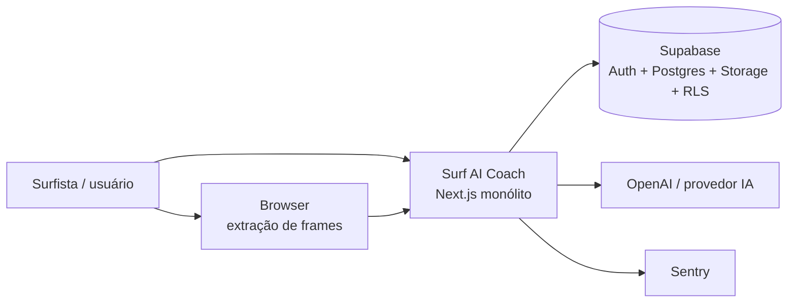

# Mapa de contexto e módulos — Surf AI Coach

**Data:** 2026-08-06  
**Branch:** `study/arquitetura-software`  
**Exercício:** dias 1–3 do plano de arquitetura

---

## 1. Diagrama de contexto

O que o sistema é, e com quem fala:



### Integrações externas

| Sistema | Papel | Risco se cair |
| --- | --- | --- |
| Supabase Auth | login, sessão, identidade | app inutilizável |
| Supabase Postgres | perfis, análises, pranchas | app inutilizável |
| Supabase Storage | vídeos/imagens | upload e análise quebram |
| OpenAI (via `lib/ai`) | feedback e ficha de prancha | core do produto para |
| Sentry | erros em produção | cegueira operacional |
| Browser (ffmpeg/canvas) | frames de vídeo no client | análise de vídeo mobile/desktop |

---

## 2. Módulos atuais (as-is)

| Módulo | Onde vive hoje | Responsabilidade |
| --- | --- | --- |
| Auth / perfil | `actions/auth-actions`, `services/profile-service`, `lib/supabase` | conta, sessão, perfil (nível, peso, altura, onda) |
| Media | `services/media-service`, `lib/media` | upload, storage path, signed URL, frames |
| Análise de performance | `actions/analysis-actions`, `services/analysis-service`, `lib/ai/*performance*` | orquestra mídia → IA → resultado |
| Prancha (board spec) | `services/board-service`, `lib/ai/*board*`, `lib/board` | fotos → ficha técnica |
| Compatibilidade | `services/board-match-service` | compara candidata x perfil/prancha mágica |
| Feedback | `services/feedback-service` | feedback do usuário |
| Segurança | `lib/security`, rate limit services | rate limit, validação de URL |
| Observabilidade | `lib/observability`, Sentry configs | report de erro |
| Presentation | `app/`, `components/` | rotas e UI |

---

## 3. Quem pode depender de quem (alvo)

```text
presentation (app/components)
    → application (actions / use-cases)
        → domain (regras e tipos puros)
        → ports (interfaces: repos, AI, storage)
            ← infrastructure (Supabase, OpenAI, ffmpeg, Sentry)
```

### Regra de ouro deste estudo

- `domain` e casos de uso **não** importam `@/lib/supabase` nem `openai` direto.
- Hoje isso ainda não está 100% verdade: vários `services/*` misturam regra + Supabase + IA.
- O gap é o laboratório (não um bug urgente).

### Dependências perigosas já vistas (hipóteses dia 1)

1. `analysis-service` conhece Supabase, IA, media e rate limit no mesmo arquivo.
2. Tipos de domínio em `lib/domain` são bons, mas ainda não há ports (`ProjectRepository`-style) claros.
3. Extração de frames existe no server e no browser: dois adapters pro mesmo problema (ok), mas o caso de uso precisa enxergar uma abstração.

---

## 4. O que provavelmente muda no futuro

| Mudança provável | Impacto se acoplado |
| --- | --- |
| Trocar provedor de IA | alto se prompts/parsing misturados com service |
| Trocar storage (S3 etc.) | alto se paths/upload espalhados |
| Filas async pra análise longa | médio: hoje parece síncrono no request |
| App mobile / RN consumindo API | alto se lógica só em Server Actions |
| Planos / billing | médio: precisa de limites por plano |

---

## 5. Requisitos não funcionais importantes

| NFR | Por quê |
| --- | --- |
| Segurança / RLS | mídia e análises são privadas por usuário |
| Custo de IA | cada análise gasta tokens; rate limit é produto |
| Latência percebida | upload + frames + modelo = fluxo longo |
| Observabilidade | falha de IA/storage precisa ser visível |
| Mobile | extração de frames no browser já foi dor real |
| Operação simples | time = 1 pessoa; monólito modular é proporcional |

---

## 6. Feature âncora para refatorar (dias 7–10)

**Análise de performance** (`createPerformanceAnalysis` e fluxo de upload).

Esboço alvo (ainda não implementado):

```text
src/modules/performance-analysis/
  domain/          # Analysis, regras de status, tipos de resultado
  application/     # CreatePerformanceAnalysis use case
  infrastructure/  # SupabaseAnalysisRepository, OpenAIPerformanceAnalyzer
  presentation/    # actions + componentes (ou adapters finos)
```

Primeiro ADR de refactor virá quando começarmos a extrair o primeiro port (ex.: `PerformanceAnalyzer` ou `AnalysisRepository`).
