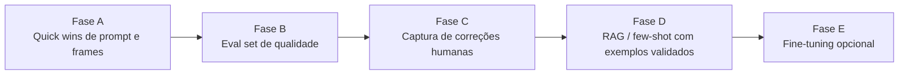

# Plano — IA de análise de performance mais especialista (17/07/2026)

> **Surf Performance & Board AI** — plano técnico para reduzir erros de nomenclatura de manobra e generalizar menos os pontos de melhoria, sem depender de "aprendizado automático" (a IA usa API stateless da OpenAI — não há fine-tuning em tempo real).

---

## Contexto e diagnóstico

Origem: usuário relatou que a IA responde bem no geral, mas ainda erra **nome da manobra** e às vezes gera **pontos de melhoria genéricos**. Investigação no código apontou 3 causas raiz e 1 lacuna de processo:

| # | Causa | Onde está no código |
|---|-------|----------------------|
| 1 | Frames de vídeo extraídos em pontos fixos (20%/50%/80% da duração), sem olhar o conteúdo — pode perder o instante exato da manobra | `lib/media/extract-video-frames.ts` (`FRAME_PERCENTAGES`) |
| 2 | Prompt não define uma taxonomia fechada de manobras com critérios visuais objetivos — só cita exemplos soltos | `lib/ai/performance-prompt.ts` (`buildPerformanceSystemPrompt`) |
| 3 | Modelo de visão usado é o mais leve da linha (`gpt-4o-mini`) para as duas tarefas (texto e visão) | `lib/ai/client.ts` (`VISION_MODEL`, `TEXT_MODEL`) |
| 4 | Não existe mecanismo para capturar "essa manobra/ponto de melhoria estava errado" por análise — só existe feedback geral de produto (`product_feedback`, nota 1–5) | `supabase/migrations/006_product_feedback.sql`, `app/(app)/admin/feedback/page.tsx` |

**Importante:** não existe "aprendizado contínuo" automático com modelos de API de terceiros. O caminho realista é: prompt melhor → medição objetiva (eval set) → captura de correções humanas → (opcional, longo prazo) RAG com exemplos validados ou fine-tuning.

---

## Visão geral das fases



| Fase | Nome | Custo/risco | Impacto esperado |
|------|------|--------------|-------------------|
| A | Prompt + extração de frames | Baixo | Alto (reduz erro de manobra rapidamente) |
| B | Eval set de qualidade | Baixo | Alto (permite medir se cada mudança melhora ou piora) |
| C | Captura de correções humanas | Médio | Médio (gera dataset de qualidade) |
| D | RAG / few-shot com exemplos validados | Médio | Alto (especialização real sem re-treinar modelo) |
| E | Fine-tuning de modelo customizado | Alto | Alto, mas só vale a pena com dataset maduro |

---

## Fase A — Quick wins de prompt e extração de frames

**Objetivo:** reduzir erros de nomenclatura de manobra e generalização nos pontos de melhoria sem mudar arquitetura.

### Entregáveis

- Taxonomia fechada de manobras com critérios visuais objetivos, embutida no prompt de sistema.
- Campo de confiança por manobra identificada, com instrução explícita para hedgear quando a evidência for fraca.
- Extração de frames mais densa/inteligente (mais amostras e/ou detecção de cena, em vez de 3 pontos fixos).
- Regra explícita contra pontos de melhoria genéricos (reforçar `melhorias_detalhadas` com exigência de referência a frame/evidência específica).
- Avaliar troca do modelo de visão (`gpt-4o-mini` → `gpt-4o` ou equivalente) nas análises de imagem/vídeo.

### Tarefas técnicas

| Área | Tarefas |
|------|---------|
| **Prompt** | `lib/ai/performance-prompt.ts` — adicionar bloco `TAXONOMIA_MANOBRAS` (nome + critério visual objetivo) referenciado no prompt de sistema de imagem/vídeo |
| **Parser** | `lib/ai/performance-parser.ts` — adicionar campo opcional `confianca_manobra` (`alta \| media \| baixa`) ao schema Zod |
| **Extração de frames** | `lib/media/extract-video-frames.ts` — aumentar amostragem (ex.: 6–8 frames) e/ou usar diferença de frame (motion) para priorizar picos de movimento |
| **Modelo de IA** | `lib/ai/client.ts` — testar `gpt-4o` como `VISION_MODEL`, medindo custo/latência antes de decidir |
| **Testes** | Atualizar testes de `performance-parser` e `extract-video-frames` para novo formato/quantidade de frames |

### Critério de saída (Fase A)

- [x] Prompt inclui taxonomia fechada de manobras com critério visual por item (`MANEUVER_TAXONOMY` em `lib/ai/performance-prompt.ts`)
- [x] `confianca_manobra` presente na resposta da IA e validado pelo parser (`lib/ai/performance-parser.ts`, `lib/domain/types.ts`)
- [x] Extração de frames captura 6 amostras por vídeo, distribuídas uniformemente (`lib/media/video-frame-sampling.ts`, usado por `extract-video-frames.ts` e `extract-video-frames-browser.ts`)
- [x] Testes unitários de parser e extração de frames atualizados e passando (`lib/__tests__/security-and-parsers.test.ts`, `lib/__tests__/video-frame-sampling.test.ts` — 43 testes ok)
- [x] Badge de confiança da manobra exibido na UI (`performance-result-view.tsx`)
- [ ] Comparação manual (5–10 análises antes/depois) mostra menos erro de nomenclatura — pendente de validação com mídia real (`OPENAI_API_KEY` configurada)
- [x] `VISION_MODEL` testado com `gpt-4o` e **revertido para `gpt-4o-mini`** em `lib/ai/client.ts` (17/07/2026) — usuário optou por validar primeiro o ganho da taxonomia/confiança/mais frames com o modelo mais barato antes de pagar ~17x mais por `gpt-4o`

> **Nota sobre custo/latência:** mantivemos `gpt-4o-mini` por enquanto. Os ganhos de precisão desta fase (taxonomia fechada, campo de confiança, 6 frames em vez de 3) já valem por si só e custam quase o mesmo que o baseline anterior. A troca para `gpt-4o` (ou outro modelo maior) fica registrada como opção testada, a ser reavaliada com o eval set da Fase B se a precisão do `gpt-4o-mini` ainda não for suficiente.

### O que foi implementado

| Item | Arquivo(s) |
|------|------------|
| Taxonomia fechada de 11 manobras com critério visual objetivo | `lib/ai/performance-prompt.ts` |
| Regra "não chutar nome" quando evidência não bate com a taxonomia | `lib/ai/performance-prompt.ts` |
| Campo `confianca_manobra` (alta/media/baixa) na resposta da IA | `lib/ai/performance-prompt.ts`, `lib/ai/performance-parser.ts`, `lib/domain/types.ts` |
| Regra de citar timestamp do frame em pelo menos 1 melhoria (vídeo) | `lib/ai/performance-prompt.ts` |
| Amostragem de frames de 3 → 6, distribuição uniforme via função pura | `lib/media/video-frame-sampling.ts` (novo), `lib/media/extract-video-frames.ts`, `lib/media/extract-video-frames-browser.ts` |
| Validação do novo número de frames no server action | `actions/analysis-actions.ts` |
| Badge de confiança da manobra na tela de resultado | `components/performance-analysis/performance-result-view.tsx` |
| Modelo de visão testado com `gpt-4o` e revertido para `gpt-4o-mini` nas análises de imagem/vídeo | `lib/ai/client.ts` |
| Testes novos/atualizados | `lib/__tests__/video-frame-sampling.test.ts` (novo, 5 testes), `lib/__tests__/security-and-parsers.test.ts` (+2 casos) |

---

## Fase B — Eval set de qualidade (medir antes de continuar)

**Objetivo:** ter uma métrica objetiva de acurácia antes de investir em RAG/fine-tuning — sem isso, qualquer mudança de prompt é palpite.

### Entregáveis

- Conjunto de 20–30 vídeos/fotos reais com gabarito (manobra correta + pontos de melhoria validados por um surfista/coach experiente).
- Script/rotina de avaliação que roda o pipeline atual contra o gabarito e reporta % de acerto de manobra e qualidade subjetiva dos pontos de melhoria.
- Registro do resultado do eval a cada mudança relevante de prompt/modelo (regressão controlada).

### Tarefas técnicas

| Área | Tarefas |
|------|---------|
| **Dataset** | Curar pasta de mídia de teste (fora do bucket de produção) + planilha/JSON de gabarito |
| **Script de avaliação** | Rotina Node/TS reaproveitando `runPerformanceAnalysis` contra o gabarito, gerando relatório de acerto |
| **Processo** | Documentar em `docs/implementation/` o resultado de cada rodada de eval (data, versão do prompt, % acerto) |

### Critério de saída (Fase B)

- [ ] Gabarito com ≥20 casos revisado por pessoa com conhecimento técnico de surf
- [ ] Script de avaliação roda localmente e gera relatório de acerto por critério
- [ ] Primeira rodada de baseline registrada (antes de qualquer mudança adicional de prompt)

---

## Fase C — Captura de correções humanas por análise

**Objetivo:** transformar erros percebidos pelo usuário/coach em dados estruturados reutilizáveis (hoje essa informação se perde).

### Schema (Postgres)

```
analysis_corrections
  id, analysis_id (FK analyses), user_id (FK profiles)
  campo (manobra_observada | melhorias_detalhadas | score | outro)
  valor_original (jsonb)
  valor_corrigido (jsonb)
  comentario (text, opcional)
  created_at
```

### Tarefas por camada

| Camada | Tarefas |
|--------|---------|
| **DB + RLS** | Migration `007_analysis_corrections.sql` — tabela + policy `auth.uid() = user_id` (dono da análise) |
| **Service** | `services/analysis-service.ts` — `submitAnalysisCorrection(userId, analysisId, campo, valorCorrigido, comentario)` |
| **Action** | `actions/analysis-actions.ts` — Zod na entrada, chama service |
| **UI** | Botão "Corrigir" no detalhe da análise (`/analyses/[id]`), abrindo formulário simples por campo |
| **Admin** | Tela leve (`/admin/feedback` ou nova `/admin/corrections`) para revisar correções acumuladas |

### Critério de saída (Fase C)

- [ ] Usuário consegue registrar uma correção em uma análise existente
- [ ] Correções ficam isoladas por RLS (usuário só vê/edita as próprias)
- [ ] Admin consegue listar correções acumuladas para curadoria futura

---

## Fase D — RAG / few-shot com exemplos validados

**Objetivo:** usar as correções e o eval set como "memória de especialista" injetada no prompt, sem re-treinar o modelo.

### Entregáveis

- Pequena base de conhecimento curada em `lib/ai/` (descrição técnica de cada manobra, erros comuns por nível de surfista).
- Seleção de 2–3 exemplos corrigidos/validados mais relevantes para o contexto da análise atual, injetados como few-shot no prompt.

### Tarefas técnicas

| Área | Tarefas |
|------|---------|
| **Base de conhecimento** | Novo módulo `lib/ai/surf-knowledge-base.ts` com conteúdo curado (não gerado por IA) |
| **Seleção de exemplos** | Lógica simples de similaridade (por tipo de onda/foco/nível) sobre `analysis_corrections` validadas |
| **Prompt** | `lib/ai/performance-prompt.ts` — bloco opcional de few-shot injetado quando houver exemplos relevantes |

### Critério de saída (Fase D)

- [ ] Base de conhecimento revisada por alguém com domínio técnico de surf
- [ ] Eval set (Fase B) mostra melhora de acurácia em relação ao baseline da Fase A

---

## Fase E — Fine-tuning de modelo customizado (opcional, longo prazo)

**Objetivo:** só avaliar depois que a Fase C acumular um volume relevante de correções validadas (ordem de centenas de casos).

### Entregáveis

- Dataset de fine-tuning exportado de `analysis_corrections` + eval set, revisado por especialista.
- Modelo customizado (fine-tuning OpenAI) avaliado contra o eval set da Fase B antes de substituir o modelo em produção.

### Critério de saída (Fase E)

- [ ] Dataset de fine-tuning com curadoria humana documentada
- [ ] Modelo fine-tunado supera o baseline no eval set antes de qualquer rollout

---

## Riscos e cuidados

- **Custo:** modelos de visão maiores (`gpt-4o`) e mais frames por vídeo aumentam custo por análise — medir antes de trocar em produção (`docs/PLANOS_E_LIMITES.md` define limites por plano).
- **Saída de IA não confiável:** todo campo novo (`confianca_manobra`, few-shot) precisa passar pela validação Zod existente antes de persistir/renderizar (`docs/SECURITY.md`).
- **Sem mocks em dev/prod:** o eval set (Fase B) roda contra mídia real de teste, nunca contra dados fictícios em produção.
- **Sequência importa:** não pular para Fase D/E sem o eval set da Fase B — sem medição objetiva, não há como saber se uma mudança ajudou ou piorou.

---

## Referências

- [Plano de Execução](../PLANO_EXECUCAO.md)
- [Segurança](../SECURITY.md)
- [Planos e Limites](../PLANOS_E_LIMITES.md)
- `lib/ai/performance-prompt.ts`, `lib/ai/performance-parser.ts`, `lib/ai/client.ts`, `lib/media/extract-video-frames.ts`
