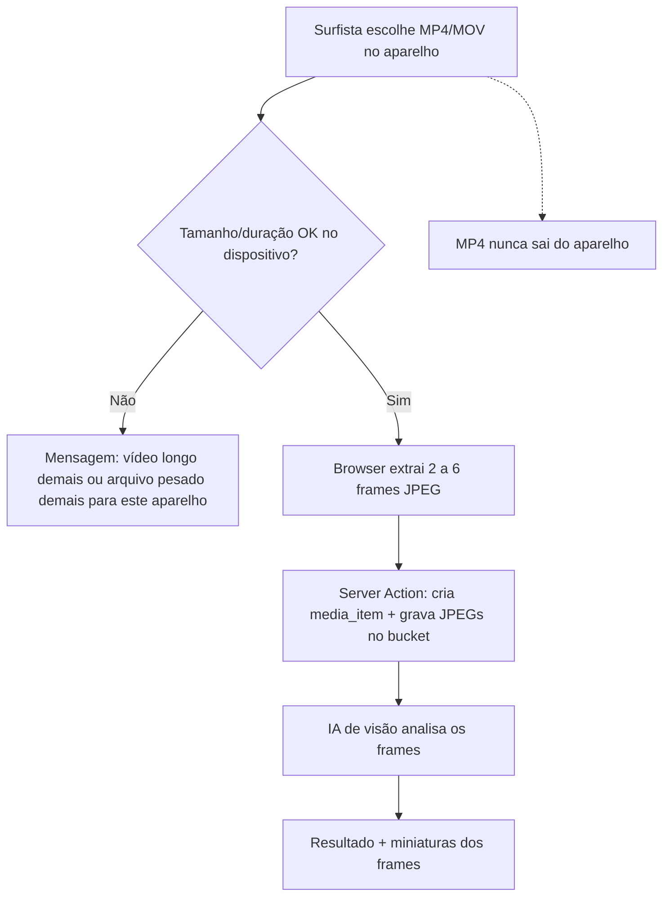

# Plano — Análise de vídeo por frames, sem armazenar o MP4 original

| Campo | Valor |
|-------|--------|
| **Status** | `aprovado` — decisões do owner 02/09/2026; Spec em `specs/` |
| **Autonomia** | `tight` (storage, `services/media-service`, schema `media_items`, upload) |
| **Data** | 2026-09-02 |
| **Owner** | Ivan Martins (ModernXLab) |
| **Origem** | Reclamações de usuários (vídeo > 50 MB) + research de 02/09/2026 |
| **Refs** | [PLANOS_E_LIMITES.md](../PLANOS_E_LIMITES.md) · [SECURITY.md — Upload](../SECURITY.md) · [Incidente 50 MB](../state/incidentes-resolvidos/2026-08-10-upload-analise-storage-ausente-e-limite-50mb.md) · [Mapa de módulos](../architecture/2026-08-06-mapa-contexto-modulos.md) |

---

## Objetivo

Parar de **subir o vídeo original** para o Supabase Storage na análise de performance. A IA já trabalha só com **~6 frames JPEG** extraídos no navegador; o MP4 no bucket não alimenta o modelo, não aparece na tela de resultado e não sustenta reanálise em produção.

O surfista deve conseguir analisar um vídeo **maior que 50 MB** sem comprimir “para o Storage aceitar”. O arquivo pesado **fica no aparelho**; a nuvem guarda só as fotos da session (e o resultado da IA).

---

## Problema observado

Usuários de câmera (iPhone, GoPro) precisam **reduzir o arquivo** antes de enviar. O teto efetivo hoje é **50 MB** — Global file size do **Supabase Free**, espelhado em `MAX_VIDEO_BYTES` e no bucket `media` (migration `010`).

A intenção de produto já era **100 MB** ([PLANOS_E_LIMITES.md](../PLANOS_E_LIMITES.md)). O incidente de 10/08/2026 alinhou o app para baixo (50 MB), não a infra para cima.

Isso é um pedágio de **infra**, não um requisito da análise.

### O que o código faz hoje

```text
1. Dropzone rejeita arquivo > 50 MB  ← usuário trava aqui
2. Browser extrai 6 JPEGs do File local
3. App sobe o MP4 inteiro para storage.media
4. Servidor manda só os JPEGs para a IA de visão
5. Tela de resultado não reproduz o vídeo (preview só de foto)
```

Pontos no código:

- Extração **antes** do upload: `components/performance-analysis/new-analysis-form.tsx`
- IA só recebe imagens: `lib/ai/analyze-performance.ts` → `chatJsonCompletionWithVision`
- Preview assinado **somente** `type === "image"`: `services/analysis-service.ts`, `analysis-media-header.tsx`
- Reanálise **não** reenvia frames; o fallback de baixar o MP4 só existe em `development` — em produção o arquivo guardado **já não serve** para retry

### Conclusão da research

Para o pipeline **atual** de vídeo, armazenar o original é lastro. Foto de sessão e fotos de prancha **continuam** no Storage (a UI depende delas).

---

## Fora de escopo

- Upgrade Supabase **Pro** ou mudança de Global file size (não é necessário se o MP4 não sobe)
- Cloudflare R2 / Stream / S3 / Mux
- Player do vídeo original na UI
- Compressão no cliente (ffmpeg.wasm) — só se o teto de **dispositivo** ainda reclamar depois desta entrega
- Alterar extração (ainda ~6 frames, `VIDEO_FRAME_COUNT`) ou o prompt/modelo de IA
- Foto de análise, prancha mágica, link YouTube/Instagram
- Migrar/apagar MP4s **já** no bucket (legado fica; análises novas usam o fluxo novo)
- Nova dependência npm

---

## Solução proposta — visão geral

| O quê | Vídeo (novo) | Foto | Link |
|-------|----------------|------|------|
| Arquivo original na nuvem | **Não** | Sim (inalterado) | N/A |
| O que a IA vê | 2–6 JPEGs | 1 imagem | Só contexto (já é assim) |
| O que persiste | Paths dos frames no bucket `media` | `storage_path` da foto | `external_url` |
| Reanálise | Relê os JPEGs do Storage | Relê a foto (já faz) | Recorre o link (já faz) |



**Princípio:** o Storage deixa de ser “hospedagem de vídeo” e vira **arquivo de evidência visual** (os mesmos frames que a IA viu).

---

## Decisões travadas pelo owner (02/09/2026)

| # | Decisão | Resposta |
|---|---------|----------|
| D1 | Guardar o MP4 original na nuvem? | **Não** — o original não sobe |
| D2 | Persistir frames no bucket + coluna `frame_paths`? | **Sim** (migration) |
| D3 | Tetos 500 MB no aparelho e 90 s de duração? | **Sim** |
| D4 | Reanálise relê os frames persistidos? | **Sim** |
| D5 | Migrar vídeos antigos já no bucket? | **Não migrar** |

### D1 — Não subir o original

Novo fluxo de vídeo **não** chama `uploadMediaFileToStorage` com o `File` de vídeo.

### D2 — Persistir frames no bucket `media` (não no `result_json`)

JPEGs em:

```text
{userId}/{mediaId}/frames/{uuid}.jpg
```

Coluna nova `media_items.frame_paths text[]` (mesmo padrão de `boards.photo_paths`).

- `storage_path` de vídeo novo: `null`
- Reanálise e exclusão LGPD usam `frame_paths`
- Miniaturas na tela da análise via signed URL (igual foto)

**Descartado:** guardar base64 no `result_json` — infla Postgres, duplica o que já vai para a IA, piora export LGPD.

### D3 — Limites: dispositivo e duração, não Storage de 50 MB

O teto de 50 MB existia porque o **arquivo ia para o bucket**. Sem upload do MP4, o teto vira proteção do **aparelho** (decodificar 4K enorme ainda trava o mobile).

| Limite | Proposta | Papel |
|--------|----------|--------|
| Tamanho no cliente (vídeo) | **500 MB** | Evitar OOM/seek eterno no celular |
| Duração | Enforçar no browser após `video.duration` — **90 s** no MVP técnico (docs comerciais: 60 s grátis / 90 s Surfista / 3 min Pro; cota por plano pode vir depois) | Anti-abuso + alinhado ao produto |
| Frames enviados | Já existe: 2–6 JPEGs, cada um ≤ ~2 MB no Zod da action | Custo IA / body da Server Action |
| Foto / prancha | 10 MB — **sem mudança** | — |

Copy do dropzone de vídeo deixa de ser “máx. 50 MB / comprima ou envie um link” e passa a explicar que **só algumas fotos da session vão para a nuvem**.

### D4 — Reanálise passa a funcionar de verdade

`retryAnalysisAction` hoje chama `createPerformanceAnalysis` **sem** frames → em produção falha com “Frames do vídeo não foram enviados”.

Com `frame_paths`, o service baixa os JPEGs, monta o mesmo payload de visão e reprocessa (1 crédito, regra já existente).

### D5 — Legado

Análises antigas com MP4 em `storage_path` e `frame_paths` vazio: **não migrar** (owner, 02/09/2026). Reanálise dessas mostra erro claro. Opcional futuro: job que extrai frames do legado ou esconde o botão de reanálise nesses itens.

---

## Fase A — App + schema (código)

### A.1 Migration — `frame_paths`

Nova migration (provável `013_media_frame_paths.sql`):

```sql
alter table public.media_items
  add column if not exists frame_paths text[] not null default '{}';
```

RLS da tabela não muda (já é `auth.uid() = user_id`). Policies de `storage.objects` no bucket `media` já autorizam pasta `{userId}/...` — frames no mesmo prefixo **reaproveitam** as policies atuais.

**Aprovação de schema é obrigatória** antes de `db:push`.

### A.2 Domínio e validação

- Estender `MediaItem` com `frame_paths: string[]`
- Helpers de path: `{userId}/{mediaId}/frames/{uuid}.jpg` + `isMediaStoragePathOwned` (já rejeita `..`)
- Limites de vídeo no cliente: tamanho 500 MB + duração 90 s (constantes nomeadas em `lib/media/upload-limits.ts` ou módulo de duração ao lado)
- Servidor **não** valida mais `file_size` do MP4 para o fluxo de vídeo; valida quantidade, MIME JPEG e tamanho de cada frame (já parcialmente no Zod da action)

### A.3 Fluxo de actions/services

**Novo caminho feliz (vídeo):**

1. Client: extrai frames (já existe).
2. `initAnalysisFileUploadAction` **ou** action dedicada: cria `media_item` `type=video`, `status=uploading`, **sem** `storage_path` de MP4.
3. `completeAnalysisFileUploadAction`: server grava cada JPEG no bucket via client autenticado (sessão do usuário), preenche `frame_paths`, `status=ready`, dispara `createPerformanceAnalysis` com os mesmos frames (sem segundo round-trip de visão).
4. Remover do caminho de vídeo: `uploadMediaFileToStorage` do MP4 e `finalizeMediaFileUpload` que lista o objeto de vídeo.

**Foto:** fluxo atual (upload direto + `storage_path`) permanece.

**Link:** inalterado.

**Limpeza:** `createAnalysisFromFileAction` (upload do `File` pela Server Action) não deve ser o caminho de vídeo; se ainda for usado, vídeo passa a recusar esse atalho ou só aceitar imagem.

### A.4 Reanálise

Em `createPerformanceAnalysis`, se `type === "video"` e não vierem `videoFrames` na chamada:

- Se `frame_paths.length >= MIN_VIDEO_FRAMES` → baixar JPEGs, montar imagens, seguir
- Senão → erro claro (legado sem frames), não tentar ffmpeg em produção

### A.5 UI

- Dropzone: copy e validação novas (tamanho 500 MB +, se possível, duração após ler o vídeo)
- Progresso: “Lendo o vídeo…” → “Extraindo frame x de y…” → “Analisando…” — **sem** “Enviando arquivo…” do MP4
- `AnalysisMediaHeader`: faixa de miniaturas dos frames (signed URLs), alvos ≥ 44px, tokens do Design System
- Microcopy: *“O vídeo não é enviado. Usamos algumas fotos da session para a análise.”*

### A.6 Privacidade / exclusão de conta

`account-privacy-service`: além de `storage_path`, apagar todos os paths em `frame_paths` no bucket `media`.

Export LGPD: incluir os paths de frames (não precisa embutir os binários no JSON se o padrão atual já lista paths).

### A.7 Arquivos prováveis

| Arquivo | Alteração |
|---------|-----------|
| `supabase/migrations/013_media_frame_paths.sql` | Coluna `frame_paths` |
| `lib/domain/types.ts` | `MediaItem.frame_paths` |
| `lib/media/upload-limits.ts` | Teto de dispositivo; copy; duração |
| `lib/media/storage-path.ts` | Path de frames |
| `lib/media/upload-client.ts` | Deixa de ser usado para MP4 de análise (pode permanecer para foto) |
| `actions/analysis-actions.ts` | Completar com persistência de frames; retry |
| `services/media-service.ts` | Gravar/listar/apagar frames; não exigir MP4 |
| `services/analysis-service.ts` | Reanálise a partir de `frame_paths`; preview de vídeo |
| `services/account-privacy-service.ts` | Delete dos frames |
| `components/performance-analysis/new-analysis-form.tsx` | Sem upload do vídeo |
| `components/performance-analysis/media-file-dropzone.tsx` | Limites e copy |
| `components/performance-analysis/analysis-media-header.tsx` | Miniaturas |
| `lib/__tests__/security-and-parsers.test.ts` | Limites novos |
| testes novos de path/frames/retry | Helpers puros + service se mockável |

`next.config.ts` `bodySizeLimit` / CSP: frames na action cabem no limite atual (6 × 2 MB ≪ 100 MB). `connect-src` não precisa de host novo.

---

## Fase B — Docs vivos e homologação (após código)

Após Done técnico (`typecheck`, `lint`, `test`):

- `docs/implementation/2026-09-02-analise-video-frames-sem-armazenar-original.md`
- Capítulo em `docs/manual-dev/` (fluxo, contas de teste, o que **não** sobe para o Storage)
- [PENDENCIAS.md](../state/PENDENCIAS.md) — item implementado vs homologação manual
- Atualizar [PLANOS_E_LIMITES.md](../PLANOS_E_LIMITES.md): vídeo de análise **não** tem teto de 50/100 MB no Storage; teto é duração + tamanho no aparelho
- Índices README de implementation e manual-dev

Homologação (POP-QA / skill manual-report):

1. Vídeo **> 50 MB e ≤ 500 MB**, duração ≤ 90 s → análise completa **sem** objeto MP4 no bucket
2. Vídeo **> 500 MB** ou **> 90 s** → rejeição na seleção/extração com causa + correção
3. Foto e link inalterados
4. Tela da análise mostra miniaturas dos frames
5. Reanálise de vídeo **novo** gera novo resultado e debita crédito
6. Excluir conta remove JPEGs de `frame_paths`
7. Mobile: extração ainda pode falhar em arquivo 4K pesado — mensagem já existente de frames insuficientes continua válida

---

## Caminho feliz (critérios de aceite)

- [ ] MP4/MOV escolhido pelo usuário **não** aparece em `storage.objects` (só `.../frames/*.jpg`)
- [ ] Análise de visão ocorre com os frames extraídos no browser
- [ ] Usuário com arquivo típico de GoPro/iPhone **> 50 MB** consegue analisar (dentro de 500 MB / 90 s)
- [ ] Dropzone **não** pede para comprimir por causa de 50 MB
- [ ] Reanálise de item novo usa `frame_paths` (não exige o MP4)
- [ ] Foto, prancha e link sem regressão
- [ ] LGPD: delete de conta limpa frames
- [ ] `npm run typecheck` · `npm run lint` · `npm test` verdes
- [ ] Nenhuma dependência nova; sem Pro/R2 nesta entrega

---

## Riscos e mitigações

| Risco | Mitigação |
|-------|-----------|
| Celular não decodifica vídeo grande/HEVC (já aconteceu) | Teto 500 MB + 90 s; mensagem de frames insuficientes; aba Link permanece |
| Usuário espera “ver o vídeo” na análise | Miniaturas + copy explícita de que o original não é enviado |
| Schema / `db:push` | Aprovar migration; não inventar coluna só no TypeScript |
| Reanálise de legado sem frames | Erro claro; não fingir que o MP4 antigo será reprocessado nesta fase |
| Abuso (muitos JPEGs / body grande) | Zod já limita 2–6 frames e tamanho; créditos + rate limit IA |
| Path crítico de storage | Spec + review humano; policies atuais cobrem o prefixo do usuário |
| Duração reportada só no client | Aceitável sem o arquivo no server; créditos limitam custo; opcional futuro: checagem mais rígida se um dia houver worker |

---

## Alternativas descartadas (nesta fase)

| Alternativa | Por quê não agora |
|-------------|-------------------|
| Subir plano Supabase Pro e 100–200 MB | Resolve o sintoma; continua pagando storage e upload de um arquivo que a IA não usa |
| Cloudflare R2 | Custo/complexidade (porta de storage, signed URL, CSP, sem RLS). Só se no futuro **quisermos guardar o original** (player, coach) |
| Comprimir no browser e ainda subir o MP4 | Trabalho extra + CPU no mobile para manter um arquivo inútil à IA |
| Analisar e **não persistir nada** (só `result_json`) | Quebra reanálise, evidência e miniaturas |

---

## Dependências

| Dependência | Status (02/09/2026) |
|-------------|---------------------|
| Extração de frames no browser | ✅ Já em produção |
| Payload de frames na complete action | ✅ Já existe |
| Policies RLS do bucket `media` | ✅ Pasta `{userId}/` |
| Aprovação deste plano | ✅ 02/09/2026 |
| Aprovação da Spec | ⏳ Pendente |
| Aprovação de migration `frame_paths` | ⏳ Junto com a Spec |
| Implementação | ⏳ Após Spec aprovada |

---

## Ordem de execução recomendada

```text
1. ~~Owner aprova o plano (D1–D5)~~ feito 02/09/2026
2. Spec aprovada
3. Migration + domínio + fluxo vídeo sem upload de MP4
4. Reanálise via frame_paths + UI de miniaturas + LGPD
5. Testes + Done commands
6. Docs vivos (implementation, manual-dev, PENDENCIAS, PLANOS_E_LIMITES)
7. Homologação manual com arquivo > 50 MB
```

---

## Próximo passo

1. ~~Owner aprova este plano~~ — **feito** (02/09/2026)
2. Spec em [`specs/2026-09-02-analise-video-frames-sem-armazenar-original.md`](../../specs/2026-09-02-analise-video-frames-sem-armazenar-original.md) — **aguardar aprovação** antes do código
3. Implementar só o que a Spec pedir — path crítico, review do diff de storage/schema

---

## Referências técnicas atuais

| Artefato | Caminho |
|----------|---------|
| Limite 50 MB | `lib/media/upload-limits.ts` |
| Upload client MP4 | `lib/media/upload-client.ts` |
| Extração browser | `lib/media/extract-video-frames-browser.ts` |
| Form análise | `components/performance-analysis/new-analysis-form.tsx` |
| Actions | `actions/analysis-actions.ts` |
| Media service | `services/media-service.ts` |
| Analysis service | `services/analysis-service.ts` |
| Header resultado | `components/performance-analysis/analysis-media-header.tsx` |
| Bucket 50 MB | `supabase/migrations/010_align_media_bucket_size_limit.sql` |
| Exclusão de conta | `services/account-privacy-service.ts` |
