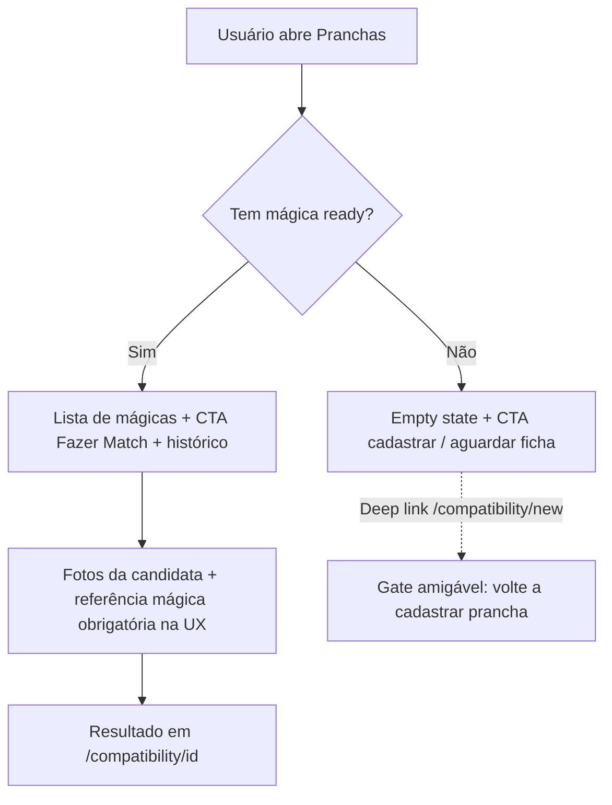

# Plano — Match integrado em Pranchas (gate UX)

| Campo | Valor |
|-------|--------|
| **Status** | `em revisão` — decisões do owner 10/09/2026; aguarda Spec |
| **Autonomia** | `medium` (UI/nav/docs; sem bloqueio backend) |
| **Data** | 2026-09-10 |
| **Owner** | Ivan Martins (ModernXLab) |
| **Origem** | Alinhamento de produto: Match só faz sentido após prancha mágica no sistema |
| **Refs** | [PRD §4.4](../PRD.md) · [PENDENCIAS FL-05](../state/PENDENCIAS.md) · [PLANO_EXECUCAO Fase 4](../PLANO_EXECUCAO.md) |

---

## Objetivo

Integrar o **Match** (compatibilidade) dentro do fluxo de **Pranchas**, deixando explícito que um depende do outro:

1. Match só é oferecido na UI depois de existir **prancha mágica** com status `ready`.
2. A navegação deixa de tratar Match como módulo irmão independente.
3. Histórico de matches antigos (inclusive sem referência) **permanece** acessível.
4. Candidata continua só como **fotos** da análise (sem virar row em `boards`).

Backend **não** recebe gate duro: a dependência é de produto/UX.

---

## Decisões do owner (10/09/2026)

| # | Pergunta | Decisão |
|---|----------|---------|
| 1 | Gate mínimo | Sim — exige **prancha mágica** |
| 2 | Tipo de bloqueio | Só **UX/UI** (sem rejeitar no service/action) |
| 3 | Prancha candidata | Continua **só fotos**, como hoje |
| 4 | Status que libera Match | Apenas boards `ready` |
| 5 | Histórico legado | Quem já fez Match **mantém** os resultados |
| 6 | Escopo docs | Spec + ajuste de PRD (mágica deixa de ser “se houver” no fluxo de produto) |
| OBS | Integração | Match **dentro de Pranchas**; alertar que um depende do outro |

---

## Problema observado

Hoje o Match **não exige** prancha cadastrada:

- Nav, dashboard e `/compatibility/new` liberam o fluxo sem checar mágica.
- Select de referência é **opcional** (“Nenhuma — avaliar só com perfil”).
- Copy às vezes fala em “perfil e prancha mágica”, mas a mágica não é pré-requisito.
- PRD §4.4 e Fase 4 do plano de execução tratam a mágica como opcional (“se houver” / “com e sem”).

Isso dilui o valor do Match e contradiz a intenção de produto: comparar candidata **com a mágica**.

### Fluxo atual

```text
Perfil → Match (fotos candidatas) → resultado
         ↑
         prancha mágica? opcional
```

### Fluxo desejado

```text
Perfil → Prancha mágica (cadastrada + ready) → Match → resultado
```



---

## Solução proposta

### Navegação

- Remover item **Match** da nav principal (`app-nav`).
- Match passa a ser descoberta/entrada via **Pranchas** (hub + detalhe da mágica).
- Rotas `/compatibility/*` **permanecem** (histórico + form) para deep links e legado.

### Hub `/boards`

- Continua listando pranchas mágicas.
- Inclui seção/CTA de Match e empty states que explicam a dependência.
- Com mágica `ready`: CTA “Fazer Match” / “Comparar outra prancha”.
- Sem mágica `ready`: alerta + CTA para cadastro (ou “aguarde a ficha ficar pronta”).

### Detalhe `/boards/[id]`

- Se `status === "ready"`: CTA “Comparar outra prancha (Match)” → `/compatibility/new?board=<id>` (pré-seleciona referência).

### `/compatibility` (histórico)

- Continua listando matches anteriores (incluindo legado sem referência).
- Botão “Nova” só ativo se existir mágica `ready`; caso contrário, empty/gate com CTA para `/boards/new` ou `/boards`.

### `/compatibility/new`

- **Gate UX:** sem mágica `ready` → alerta + CTA cadastro (não 404; deep link amigável).
- Com mágica `ready` → formulário; select de referência **obrigatório** na UI (não mais “opcional”).
- Candidata: upload de fotos + medidas anunciadas opcionais (inalterado).

### Dashboard

- CTA de compatibilidade só ativo/visível com mágica `ready`.
- Sem mágica: copy/CTA aponta para cadastrar prancha mágica.

### Empty states (copy)

1. **Sem nenhuma prancha:** “Cadastre sua prancha mágica para liberar o Match.”
2. **Só draft / processing / error:** “Aguarde a ficha ficar pronta para comparar outras pranchas.”
3. **Com ready, sem matches:** “Compare uma prancha candidata com a sua mágica.”

---

## Arquivos prováveis

| Área | Arquivos |
|------|----------|
| Nav | `components/layout/app-nav.tsx` |
| Hub Pranchas | `app/(app)/boards/page.tsx` (+ eventual `components/board-spec/boards-match-section.tsx`) |
| Detalhe | `app/(app)/boards/[id]/page.tsx` |
| Histórico Match | `app/(app)/compatibility/page.tsx` |
| Novo Match | `app/(app)/compatibility/new/page.tsx` |
| Form | `components/board-spec/board-match-form.tsx` |
| Dashboard | `app/(app)/dashboard/page.tsx` |
| Spec | `specs/2026-09-10-match-depende-prancha-magica.md` |
| PRD | `docs/PRD.md` §4.4 |
| Docs vivos (ao fechar) | `docs/implementation/` · `docs/manual-dev/` · `docs/state/PENDENCIAS.md` |

---

## Fora de escopo

- Bloqueio em `board-match-service` / `createBoardMatchAction`
- Migrar candidata para tabela `boards` / CRUD de candidatas
- Apagar ou ocultar matches antigos sem `reference_board_id`
- Mudança de créditos, billing ou schema
- Remover rotas `/compatibility/*`

---

## Riscos

| Risco | Mitigação |
|-------|-----------|
| Bookmark em `/compatibility/new` sem mágica | Gate amigável com CTA, não 404 |
| Match some da nav mobile | CTA forte no hub `/boards` e no detalhe `ready` |
| PRD ainda diz “se houver” | Atualizar §4.4 no mesmo ciclo da Spec |
| Backend ainda aceita Match sem referência | Aceito por decisão (só UX); documentar na Spec |

---

## Ordem de entrega

1. Spec curta em `specs/` → aprovação humana  
2. Nav + hub `/boards` + CTA no detalhe  
3. Gates em `/compatibility` e `/compatibility/new` + form com referência obrigatória na UI  
4. Dashboard  
5. PRD §4.4 + docs vivos + `npm run typecheck` · `lint` · `test`  

---

## Done (quando implementar)

- [ ] Spec aprovada
- [ ] Match não aparece como item irmão na nav
- [ ] Sem mágica `ready`, UI de “novo Match” redireciona/alerta para Pranchas
- [ ] Com mágica `ready`, fluxo novo exige referência na UX
- [ ] Histórico legado permanece listável
- [ ] PRD §4.4 alinhado
- [ ] Docs vivos atualizados (implementation · manual-dev · PENDENCIAS)
- [ ] Comandos Done verdes

---

## Próximo passo

Aprovar este plano → escrever Spec em `specs/2026-09-10-match-depende-prancha-magica.md` → implementar só o que a Spec pedir.
