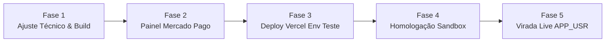

# Plano — Ativação e Homologação do Mercado Pago (Cobrança)

| Campo | Valor |
|-------|--------|
| **Status** | `concluído` — homologação real com Pack S (R$ 19 via PIX) aprovada e créditos refletidos em 12/09/2026 |
| **Autonomia** | `medium` (código de billing já existe; ajuste de tipo + deploy + homologação) |
| **Data** | 2026-09-12 |
| **Owner** | Ivan Martins (ModernXLab) |
| **Origem** | Etapa 4 / Trilha H do Plano Go-Live — liberar cobrança de assinaturas e packs |
| **Refs** | [specs/2026-09-02-billing-mercadopago.md](../../specs/2026-09-02-billing-mercadopago.md) · [docs/manual-dev/08-fase-billing-mercadopago.md](../manual-dev/08-fase-billing-mercadopago.md) · [PLANO_GO_LIVE_COBRANCA.md](../state/PLANO_GO_LIVE_COBRANCA.md) |

---

## Objetivo

Ativar operacionalmente e homologar de ponta a ponta o gateway de pagamentos **Mercado Pago** no ambiente de produção da Vercel (`https://surfiacoach.modernxlab.com.br`), garantindo:

1. **Ajuste fino de TypeScript** no cliente do Mercado Pago para build limpo.
2. **Configuração de Webhooks** no painel de desenvolvedores do Mercado Pago apontando para a URL canônica do app.
3. **Homologação em Sandbox** via cartões/compradores de teste para:
   - Assinatura recorrente (Planos Surfista e Pro via `PreApproval`).
   - Compra avulsa de créditos (Packs S e M via `Checkout Pro`).
   - Cancelamento de assinatura via `/billing`.
4. **Virada para Produção (`APP_USR-`)** permitindo abertura do SaaS para clientes reais.

---

## Contexto e Estado Atual

- **Código base:** 100% implementado em `lib/billing/`, `services/billing-service.ts`, `app/api/webhooks/mercadopago/route.ts`, páginas `/planos` e `/billing`.
- **Testes unitários:** 18 arquivos de teste e 136 casos passando (100%).
- **Banco de Dados:** Todas as 13 migrations já aplicadas no Supabase de produção (inclusive `011`, `012` e `013`).
- **Domínio & SSL:** `https://surfiacoach.modernxlab.com.br/` já ativo e funcional na Vercel.
- **E-mails transacionais:** Ativo via `surfiacoah@mail.modernxlab.com.br` no Supabase Auth.
- **Ponto de atenção técnico:** Erro de compilação TS em `lib/billing/mercadopago-client.ts`: o SDK do Mercado Pago (`mercadopago@^3.6.0`) não aceita `notification_url` no corpo da chamada `PreApproval.create` (pois assinaturas utilizam o webhook configurado a nível de aplicação no painel).

---

## Fases de Execução

### Fase 1 — Ajuste Técnico no Código e Verificação Local
- **Ajustar `lib/billing/mercadopago-client.ts`:**
  - Remover `notification_url` do payload do `PreApproval.create` (as notificações de preapproval são recebidas via webhook global configurado na aplicação do MP).
  - Manter `notification_url` em `Preference.create` (onde é formalmente suportado pelo Checkout Pro).
- **Verificar suíte completa:**
  - `npm run typecheck` deve zerar erros.
  - `npm run lint` sem advertências.
  - `npm test` verde (136/136).

### Fase 2 — Configuração da Aplicação no Painel do Mercado Pago (Owner)
- Acessar o [Painel de Desenvolvedores do Mercado Pago](https://www.mercadopago.com.br/developers/panel/app).
- Selecionar a aplicação **Surf AI Coach**.
- Em **Notificações Webhooks**:
  - Configurar a URL de produção: `https://surfiacoach.modernxlab.com.br/api/webhooks/mercadopago`
  - Habilitar os tópicos:
    - **Pagamentos (legacy)** (`payment`)
    - **Planos e assinaturas** (`subscription_preapproval`, `subscription_authorized_payment`)
- Copiar a chave secreta gerada (**Secret de Webhook**).
- Obter o **Access Token de Teste** (`TEST-...`) em *Credenciais de Teste*.

### Fase 3 — Configuração de Ambiente na Vercel & Deploy
- No painel da Vercel (Projeto `surfAICoach` → *Settings* → *Environment Variables*):
  - `MP_ACCESS_TOKEN`: colar o token `TEST-...`
  - `MP_WEBHOOK_SECRET`: colar o secret copiado na Fase 2
  - Confirmar `NEXT_PUBLIC_SITE_URL=https://surfiacoach.modernxlab.com.br`
- Subir o commit do ajuste da Fase 1 para a branch principal para disparar o deploy.

### Fase 4 — Homologação Sandbox E2E (Testes com Cartão Simulado)
Executar os cenários de teste documentados no POP de billing:
1. **Compra de Pack Avulso (Pack S - R$ 19):**
   - Entrar no app com uma conta de teste.
   - Ir em `/planos` → Comprar Pack S (+5 créditos).
   - Concluir pagamento no Checkout Pro com cartão de teste ou PIX simulado do MP.
   - Conferir se o webhook retorna `200` e se o saldo de créditos no dashboard sobe +5 sem alterar o plano.
2. **Assinatura Recorrente (Plano Surfista - R$ 39/mês):**
   - Ir em `/planos` → Assinar Surfista.
   - Preencher cartão de teste no `init_point` do Mercado Pago.
   - Conferir se o webhook `subscription_preapproval` atualiza o plano para `surfista` e credita 8 créditos.
3. **Cancelamento de Assinatura:**
   - Ir em `/billing` → Clicar em "Cancelar assinatura".
   - Conferir se o status no app atualiza para cancelada, mantendo o acesso até o fim do período já pago.
4. **Resiliência a Duplicidade:**
   - Conferir se reenvios de webhook não duplicam créditos (idempotência via `usage_ledger`).

### Fase 5 — Virada de Chave para Produção (Go-Live Comercial)
- Obter o **Access Token de Produção** (`APP_USR-...`) no painel do MP (após aprovação cadastral/KYC do Mercado Pago).
- Se houver secret de webhook exclusivo para produção, copiá-lo.
- Atualizar as variáveis de ambiente na Vercel:
  - `MP_ACCESS_TOKEN=APP_USR-...`
  - `MP_WEBHOOK_SECRET=<secret_prod>`
- Realizar redeploy na Vercel.
- Marcar a Trilha H como 🟢 Concluída em `docs/state/PLANO_GO_LIVE_COBRANCA.md` e `docs/state/PENDENCIAS.md`.

---

## Critérios de Done

- [ ] `typecheck`, `lint` e `test` 100% verdes localmente e no build da Vercel.
- [ ] Webhook do Mercado Pago recebendo eventos na URL oficial com assinatura HMAC validada.
- [ ] 1 compra de pack avulso e 1 assinatura testadas com sucesso em sandbox.
- [ ] Cancelamento funcionando via UI de `/billing`.
- [ ] Tokens de produção (`APP_USR-`) configurados para lançamento público.
