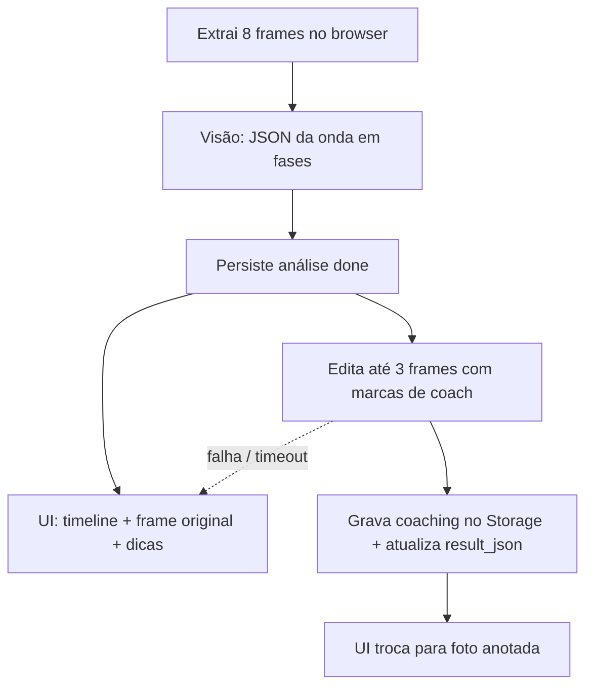

# Plano — Análise da onda completa (vídeo)

| Campo | Valor |
|-------|--------|
| **Status** | `em revisão` — aguarda aprovação do owner antes da Spec |
| **Autonomia** | `tight` (`lib/ai/**`, `lib/domain/**`, possível path de Storage) |
| **Data** | 2026-09-14 |
| **Owner** | Ivan Martins (ModernXLab) |
| **Origem** | Feedback de analista (iniciantes) + [research](./2026-09-14-research-melhoria-analise-ondas.md) |
| **Refs** | [Especialização IA](../implementation/2026-07-17-plano-especializacao-ia-performance.md) · [PLANOS_E_LIMITES](../PLANOS_E_LIMITES.md) · [SECURITY](../SECURITY.md) · [DESIGN_SYSTEM §11.3](../DESIGN_SYSTEM.md) |

---

## Objetivo

A análise de **vídeo** deixa de julgar “a manobra mais relevante” e passa a analisar a **onda inteira**, fase a fase, com dica concreta de como melhorar e **imagem de coaching no próprio frame** (nível C).

O surfista deve sair da tela entendendo, em cada momento alto: o que aconteceu, se foi bem ou mal, e **o que fazer no corpo/prancha** — olhar, bico, mão, amplitude do bottom turn — vendo o traço **na foto dele**.

---

## Decisões do owner (14/09/2026)

| # | Pergunta | Decisão |
|---|---------|---------|
| 1 | Tom | Didático, com **como melhorar concreto** (olhar, bico, mão, joelhos) |
| 2 | Cobertura | **Timeline completa** da onda |
| 3 | Amostragem | **8 frames** enviados à IA (vídeo continua só no aparelho) |
| 4 | UI | Cards/timeline por fase, cada uma com o frame da evidência |
| 5 | Gabarito | Os 2 vídeos (point lento + beach break) |
| 6 | Escopo de mídia | **Só vídeo**. Foto e link não mudam |
| 7 | Coaching visual | **Nível C neste ciclo**: imagem gerada/editada pela IA a partir do frame real |

---

## Problema observado

Hoje o pipeline extrai **6 JPEGs uniformes**, a IA devolve **uma** `manobra_observada` e um score holístico. Sintomas confirmados no feedback:

1. Só a primeira manobra recebe feedback de verdade; o resto da onda vira menção.
2. “Entrada mais agressiva” sai igual em point lento e beach rápido — sem cadência relativa.
3. Batida errada pode ser elogiada; o badge “alta confiança” parece “você fez bem”.
4. Abortar a 2ª manobra vira “falta de consistência”, não leitura de seção.
5. Os cortes uniformes perdem picos; o surfista quer os momentos altos **e** ver **onde** ajustar.

A Fase A da especialização (taxonomia, 6 frames, confiança) está no código. Este plano redireciona o investimento: o gargalo agora é **cobertura da onda + criticidade + visual de coaching**.

---

## Fora de escopo

- Análise de **foto** e **link**
- Overlay SVG no cliente (nível B da research) — C substitui
- Foto fotorealista de **outro** surfista / onda inventada
- Detecção de pose, tracking de joints, ffmpeg no servidor
- Voltar a subir o MP4
- Amostragem por pico de movimento (fica para um ciclo seguinte; agora são 8 cortes uniformes)
- Troca de modelo (`gpt-4o`) — só se o gabarito ainda elogiar manobra falhada
- Fine-tuning / RAG
- Mudar o preço do crédito (continua **1 crédito** por análise, incluindo as imagens de coaching)
- Nova dependência npm
- Comparação lado a lado de sessões

---

## Solução proposta — visão geral

```text
Vídeo no aparelho
  → 8 JPEGs (uniforme, mín. 2 no mobile)
  → IA visão: JSON da onda em fases (texto + dicas)
  → persiste análise `done` (surfista já vê a timeline)
  → IA imagem: edita até 3 frames-chave (marcas de coach)
  → cards da fase mostram foto anotada quando pronta
```



**Princípio:** a análise textual **não espera** a imagem. C é o alvo visual; se a edição falhar, o card continua útil (frame original + texto). Nunca debitar um segundo crédito.

---

## Nível C — o que entra de verdade

A research listou C como “IA gera foto nova” e recomendou não usar. O owner escolheu C **neste ciclo**. Recorte operacional:

| Fazemos | Não fazemos |
|---------|-------------|
| **Editar o JPEG real da fase** com seta, arco, zona (“chegar até aqui no BT”, “entrar no lip nesta linha”) | Gerar um surfista fictício em outra onda |
| No máximo **3** imagens por análise (fases com execução regular/falhou e evidência no frame) | Anotar os 8 frames |
| Copy: “Ajuste sugerido neste instante” | “Foto ideal” / “é assim que deveria ter ficado o corpo” fotorealista |
| Fallback silencioso para o frame original | Bloquear o resultado se a imagem falhar |

A edição vive em `lib/ai/` (única porta). Instruções de desenho são do **sistema**; o frame do usuário é só a imagem de entrada (anti prompt injection). A imagem gerada é saída **não confiável**: validar MIME/tamanho no servidor, gravar no bucket privado, **nunca** reenviar essa imagem para uma nova análise.

Timeout da Vercel (~55 s) **não** comporta 8 visões `detail: high` + 3 image edits no mesmo request. Por isso C é um **passo 2** depois do `done`.

---

## Contrato da resposta (vídeo)

Manter score, resumo, pontos fortes, melhorias e prioridades para não quebrar análises antigas. Acrescentar:

```text
fases[]:
  nome                 — taxonomia já existente (Drop, Bottom turn, Batida, …)
  frame_index          — índice 0-based nos 8 frames
  timestamp            — rótulo já usado (ex.: 0:12)
  qualidade_execucao   — boa | regular | falhou
  confianca_identificacao — alta | media | baixa   (NÃO é qualidade)
  o_que_vi             — evidência neste frame
  como_melhorar        — didático e concreto (olhar, bico no relógio, mão, joelhos)
  coaching_image_path  — path no Storage, opcional até o passo 2

leitura_da_secao:
  o_que_a_onda_fez
  alternativa          — o que emendar / por que abortar fez (ou não) sentido
```

Regras de prompt (vídeo):

- Emitir fase **só** com evidência no JPEG; se inferir, `confianca_identificacao = baixa`.
- Não elogiar execução se a manobra falhou. Confiança alta de identificação **não** sobe nota de técnica.
- Drop relativo ao tipo de onda: point pode ser cadenciado; desacelerar para entrar no face pode ser correto; nunca “mais agressivo” como dica padrão.
- `como_melhorar` obrigatório em fase regular/falhou: pelo menos um de olhar, direção do bico, mão/rail, amplitude (BT / vertical da batida).
- `manobra_observada` legado = fase de manobra mais relevante (compat UI antiga).

Parser Zod valida o JSON novo e aceita o formato antigo (sem `fases`).

---

## UI (só resultado de vídeo)

Seguir [DESIGN_SYSTEM §11.3](../DESIGN_SYSTEM.md): conteúdo do usuário primeiro, dark, mobile-first, alvos ≥ 44px, tokens semânticos.

Ordem da tela:

1. Surf Score + critérios (como hoje)
2. **Timeline da onda** — cards por fase (drop → BT → linha → manobras → aborto/seção)
3. Cada card: frame (original, depois anotado) · qualidade · certeza da identificação **com rótulo explícito** · o que vi · como melhorar
4. Bloco **Leitura da seção**
5. Resumo técnico (cita as fases, não só a primeira)
6. Pontos fortes / melhorias / prioridades

Enquanto a imagem de coaching não chegou: o frame original + estado `processando` curto (“Preparando o visual do ajuste”). Se falhar: some o estado e fica o original. Sem spinner eterno.

Foto/link: `PerformanceResultView` atual, sem timeline.

---

## 8 frames

| Constante | Hoje | Destino |
|-----------|------|---------|
| `VIDEO_FRAME_COUNT` | 6 | **8** |
| `MIN_VIDEO_FRAMES` | 2 | **2** (mobile frágil) |

Ainda distribuição uniforme em `computeFrameTimestamps` (sem detecção de movimento neste plano). Atualizar Zod da action, extrator do browser, `cost-baseline` (vídeo ~8 imagens) e testes.

Microcopy do dropzone: “algumas fotos” continua válida; não precisa citar o número.

---

## Storage, crédito, LGPD

- Path: `{userId}/{mediaId}/coaching/{analysisId}/{uuid}.png` (policies atuais do bucket `media` cobrem o prefixo do usuário).
- Persistir o path em `result_json.fases[].coaching_image_path` (jsonb já existe — **sem migration** neste plano).
- Exclusão de conta: além de `storage_path` / `frame_paths`, apagar paths de coaching lidos do `result_json` das análises do usuário.
- Reanálise: 1 crédito; gera fases novas e pode gerar imagens novas; arquivos da análise anterior permanecem até delete de conta (ou cleanup futuro).
- 1 crédito = visão + até 3 edições. Falha na edição **não** estorna nem cobra extra.

Se no review da Spec o owner preferir coluna `coaching_image_paths text[]` em `analyses` (delete mais simples), isso vira migration **à parte**, com aprovação explícita.

---

## Fases de implementação (após Spec aprovada)

### Fase 1 — Onda em fases + 8 frames (obrigatória, entrega valor sozinha)

Prompt, parser, tipos, 8 frames, timeline na UI com **frame original + dicas**. Badge de identificação vs qualidade. Cadência de drop. Foto/link intocados.

Critério de saída da Fase 1: um vídeo novo mostra várias fases; batida falha não é elogiada; drop não é “mais agressivo” nos dois mares sem contexto.

### Fase 2 — Coaching visual C (mesmo ciclo)

Porta `lib/ai/` de image edit; passo 2 após `done`; até 3 imagens; UI troca o frame; usage log; LGPD; fallback.

Critério de saída da Fase 2: pelo menos uma fase com execução a melhorar ganha foto anotada; se a API de imagem cair, a timeline continua completa.

### Fase 3 — Gabarito (homologação, não código extra)

Rodar os 2 vídeos do especialista contra a Fase 1+2. Checklist:

- [ ] Point: drop **não** cobra agressividade irreal; desacelerar no face pode aparecer como leitura correta
- [ ] Beach: batida errada = `falhou` (ou regular), não “bem executada”
- [ ] 2ª manobra abortada = leitura de seção, não só “inconsistência”
- [ ] Timeline cobre drop, BT e manobras visíveis (não só a primeira)
- [ ] Imagem de coaching aponta o ajuste no instante certo (se não apontar, registrar e decidir se C segue)

---

## Arquivos prováveis

| Área | Paths |
|------|--------|
| IA | `lib/ai/performance-prompt.ts`, `performance-parser.ts`, `analyze-performance.ts`, `client.ts`, novo módulo de image edit, `usage-log.ts`, `cost-baseline.ts` |
| Domínio | `lib/domain/types.ts`, `analysis-display.ts` |
| Mídia | `lib/media/video-frame-sampling.ts`, `extract-video-frames-browser.ts`, `storage-path.ts` |
| Actions / services | `actions/analysis-actions.ts`, `services/analysis-service.ts`, `media-service.ts`, `account-privacy-service.ts` |
| UI | `performance-result-view.tsx`, possível `wave-phase-timeline.tsx` / `wave-phase-card.tsx` em `components/performance-analysis/` |
| Testes | `security-and-parsers.test.ts`, `video-frame-sampling.test.ts` + testes do parser de `fases` e do path de coaching |

Não mexer em billing, auth, Mercado Pago, prancha, match, `middleware.ts`.

---

## Caminho feliz (aceite)

- [ ] Vídeo novo extrai até 8 frames; mobile ainda aceita ≥ 2
- [ ] Resultado em fases na ordem da onda, cada uma com frame e “como melhorar” concreto quando não foi boa
- [ ] Confiança da identificação **não** se apresenta como “manobra bem feita”
- [ ] Até 3 fotos anotadas (C) nas fases que pedem ajuste; fallback no original
- [ ] Foto, link e análises antigas (sem `fases`) continuam renderizando
- [ ] 1 crédito; exclusão de conta apaga frames **e** coachings
- [ ] Gabarito dos 2 vídeos documentado (Fase 3)
- [ ] `npm run typecheck` · `npm run lint` · `npm test` verdes
- [ ] Docs vivos (implementation + manual-dev + PENDENCIAS)

---

## Riscos e mitigações

| Risco | Mitigação |
|-------|-----------|
| Image edit alucina o corpo/onda | Só editar o frame real; copy deixa claro que é **ajuste sugerido**; máx. 3; homologar no gabarito; se errar o traço, desligar C sem derrubar a Fase 1 |
| Timeout 55 s | Passo 2 depois do `done`; UI não bloqueia |
| Custo (8 visões + até 3 imagens) | 1 crédito; medir `ai.usage` após a primeira dezena; teto de 3 edições |
| Modelo inventa fases | Fase só com `frame_index` válido; confiança baixa se inferir |
| Mobile extrai < 8 frames | Mínimo 2; timeline usa os que existirem |
| Surfista minúsculo no quadro | C pode ser inútil; gabarito decide se seguimos |
| Path crítico IA/domínio | Spec + review humano do diff |

---

## Alternativas descartadas neste plano

| Alternativa | Por quê |
|-------------|---------|
| Só texto + frame (nível A) como entrega final | Owner escolheu C neste ciclo; A fica como **fallback** |
| Overlay SVG (nível B) | C cobre o “riscar o frame”; B seria duplicata |
| Gerar foto de outro surfista | Quebra confiança e o Design System (conteúdo do usuário primeiro) |
| 8 frames + 3 edits no mesmo Server Action | Estoura timeout |
| 12+ frames agora | Owner travou 8; custo/latência |

---

## Relação com o plano de especialização (17/07)

| Fase antiga | Neste plano |
|-------------|-------------|
| A (prompt + 6 frames) | Superada: 8 frames + fases + criticidade |
| B (eval set) | Começa enxuta: 2 vídeos gabarito (Fase 3) |
| C–E (correções / RAG / fine-tune) | Fora |

---

## Ordem de execução

```text
1. Owner aprova este plano (decisões 1–7)
2. Spec em specs/ — aguardar aprovação (tight)
3. Fase 1: prompt/parser/tipos/8 frames/timeline
4. Fase 2: image edit + UI da foto anotada + LGPD
5. typecheck, lint, test
6. Docs vivos
7. Fase 3: homologar nos 2 vídeos gabarito
```

---

## Próximo passo

1. **Owner aprova este plano** (ou pede ajuste no recorte de C / teto de 3 imagens)
2. Spec em `specs/2026-09-14-analise-onda-completa.md` — **sem código** até a Spec aprovada
3. Implementar só o que a Spec pedir

---

## Referências técnicas atuais

| Artefato | Caminho |
|----------|---------|
| Prompt / parser | `lib/ai/performance-prompt.ts`, `performance-parser.ts` |
| Cliente IA | `lib/ai/client.ts` (`gpt-4o-mini`, visão `detail: high`) |
| Amostragem | `lib/media/video-frame-sampling.ts` |
| Resultado UI | `components/performance-analysis/performance-result-view.tsx` |
| Miniaturas | `components/performance-analysis/analysis-media-header.tsx` |
| Service | `services/analysis-service.ts` |
| Tipos | `lib/domain/types.ts` (`PerformanceResult`) |
