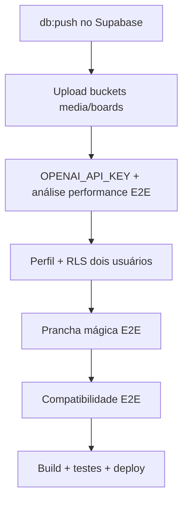

# Pendências — Surf Performance & Board AI

> Consolidado a partir do checklist de [implementação 03/07/2026](../implementation/2026-07-03-fundacao-mvp-inicial.md).  
> **Status:** FL-03 Performance e FL-04 Prancha mágica validados E2E; perfil e RLS pendentes.  
> **Última revisão:** 07/07/2026 — TC-15 a TC-18 aprovados; FL-04 completo (4/4 TCs).

---

## 🔴 Prioridade imediata (próxima sessão)

Itens bloqueadores para os fluxos principais funcionarem de ponta a ponta.

- [x] Confirmar `npm run db:push` no projeto Supabase remoto (5 migrations: profiles, media/analyses, boards, storage policies, buckets)
- [x] Configurar `OPENAI_API_KEY` em `.env.local` *(créditos inseridos na conta OpenAI)*
- [x] Testar uma análise de performance completa com IA real (link YouTube — TC-09; imagem + visão — TC-10; vídeo + frames — TC-11)
- [x] Testar upload de vídeo no bucket `media` *(TC-11, 07/07/2026)*
- [x] Testar upload de fotos de prancha no bucket `boards` *(TC-15, 07/07/2026)*
- [ ] Validar edição de perfil e persistência dos dados
- [ ] Validar isolamento RLS entre dois usuários distintos

---

## 🟡 Fase 0 — Fundação técnica

Critérios de saída ainda não validados:

- [x] `npm run build` validado localmente com env de produção (`.env.local`, 07/07/2026)
- [ ] Deploy (Vercel + Supabase prod)

---

## 🟡 Fase 1 — Autenticação e perfil (P0)

Critérios de saída ainda não validados:

- [ ] Edição de perfil validada E2E (persistência confirmada)
- [ ] RLS testado com dois usuários distintos *(também em prioridade imediata)*
- [ ] Checklist `SECURITY.md` §A07 revisado formalmente

---

## 🟡 Fase 2 — Análise de performance (P0)

Critérios de saída ainda não validados:

- [x] Análise IA completa via link YouTube *(TC-09, 07/07/2026)*
- [x] Upload de imagem no bucket `media` + IA visão *(TC-10, 07/07/2026)*
- [x] Listagem diferencia Imagem / Link / Vídeo com score e preview *(TC-14)*
- [x] Upload de vídeo no bucket `media` + IA frames *(TC-11, 07/07/2026)*
- [x] Link malicioso rejeitado em fluxo real *(TC-12, 07/07/2026)*

---

## 🟡 Fase 3 — Prancha mágica (P0)

Critérios de saída ainda não validados:

- [x] `npm run db:push` aplicado no projeto Supabase remoto *(também em prioridade imediata)*
- [x] Upload de ≥3 fotos testado no bucket `boards` *(TC-15, 07/07/2026)*
- [x] Ficha técnica gerada e persistida com IA real *(TC-16, 07/07/2026)*
- [x] Resumo “por que funciona para você” validado com perfil completo *(TC-17, 07/07/2026)*
- [x] Detalhe em `/boards/[id]` e listagem validados *(TC-18, 07/07/2026)*

---

## 🟡 Fase 4 — Compatibilidade de prancha (P1)

Critérios de saída ainda não validados:

- [ ] Análise de compatibilidade testada E2E com IA
- [ ] Veredito, prós, contras e condições ideais validados na UI

---

## 🟢 Fase 5 — Polish e lançamento

- [ ] Cobertura de testes ≥80% em services/parsers
- [ ] Expandir suite de testes (parsers de board-spec e board-match)
- [ ] Empty states e onboarding revisados em mobile
- [ ] Observabilidade (logs sem PII)
- [ ] Deploy produção (Vercel) *(também em Fase 0)*
- [ ] Checklist final `SECURITY.md` + Design System §15

---

## Ordem sugerida de execução

1. ~~**Infra:** `db:push` → buckets e policies ativos~~ ✅
2. ~~**IA performance:** link ✅ · imagem ✅ · vídeo ✅ · segurança URL ✅~~ *(FL-03 completo)*
3. ~~**Prancha mágica:** upload bucket boards ✅ · ficha técnica IA ✅ · detalhe/listagem ✅~~ *(FL-04 completo)*
4. **Auth/dados:** perfil + RLS
5. **Módulos:** compatibilidade
6. **Qualidade:** testes, build ✅ parcial, security/design checklist, deploy

---

## Referências

- [Implementação 03/07/2026](../implementation/2026-07-03-fundacao-mvp-inicial.md)
- [Plano de Execução](../PLANO_EXECUCAO.md)
- [Segurança](../SECURITY.md)
- [Relatório de testes manuais](../relatorio-testes-manuais.html)

