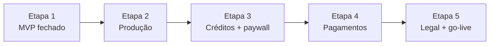

# Pendências — Surf Performance & Board AI

> **Objetivo:** fechar MVP funcional → deploy produção → monetização SaaS → lançamento comercial.  
> **Status atual:** MVP funcional homologado (26/26 TCs) · Etapa 1.1–1.3 em fechamento · deploy e monetização **não implementados**.  
> **Última revisão:** 13/07/2026 — IA visão board-match validada E2E (TC-20 revalidado).

---

## Visão geral

| Marco | Situação | Homologação |
|-------|----------|-------------|
| Auth + perfil | ✅ Código + E2E | FL-01 (7/7) · FL-02 (3/3) |
| Análise performance | ✅ Código + E2E | FL-03 (6/6) |
| Prancha mágica | ✅ Código + E2E | FL-04 (4/4) |
| Compatibilidade | ✅ Código + E2E | FL-05 (2/2) |
| Segurança RLS | ✅ Validado | FL-06 (2/2) |
| Shell / mobile | ✅ Validado | FL-07 (2/2) |
| Monetização | ❌ Não existe | — |
| Pagamentos | ❌ Não existe | — |
| Deploy produção | ❌ Não feito | — |
| Legal (LGPD / Termos) | ❌ Não existe | — |

**Total homologação:** 26/26 TCs aprovados (100%).

---

## Plano de execução — Lançamento SaaS



| Etapa | Foco | Estimativa | Critério de saída |
|-------|------|------------|-------------------|
| **1** | MVP funcional fechado | ~1 semana | 26/26 TCs · RLS validado |
| **2** | Infra produção | ~2–3 dias | URL pública · env prod · rate limit persistente |
| **3** | Monetização mínima | ~1 semana | Créditos free · paywall · ledger |
| **4** | Pagamentos | ~1–2 semanas | Stripe/MP · planos · webhooks |
| **5** | Legal + lançamento | ~3–5 dias | Termos · privacidade · beta pago |

---

## Etapa 1 — MVP funcional fechado 🟡

> **Quase concluída.** E2E 100% + segurança revisada + IA visão board-match. Falta apenas validação visual formal DoD.

### 1.1 Validação E2E ✅ *(26/26 TCs — 13/07/2026)*

- [x] **TC-19** — Compatibilidade com prancha mágica de referência (`/compatibility/new` → IA → `/compatibility/[id]`) *(13/07/2026)*
- [x] **TC-20** — Veredito, prós, contras e condições ideais na UI *(13/07/2026 — IA visão nas fotos candidatas validada E2E)*
- [x] **TC-21** — Isolamento RLS: usuário A não vê análises/pranchas/perfil de usuário B *(13/07/2026 — Ivan Martins vs Ivan Barbosa; dashboard e métricas isolados)*
- [x] **TC-22** — Storage: arquivos no bucket acessíveis só pelo dono (policy RLS) *(13/07/2026 — isolamento confirmado com duas contas)*
- [x] **TC-23** — Dashboard com CTAs para análises, pranchas e compatibilidade *(13/07/2026 — CTAs validados E2E)*
- [x] **TC-24** — Navegação mobile (viewport ≤390px, alvos ≥44px, sem overflow) *(13/07/2026)*

### 1.2 Perfil e segurança ✅ *(13/07/2026)*

- [x] Edição de perfil validada E2E *(TC-06/07/08, 07/07/2026)*
- [x] Revalidar perfil após mudanças recentes — sem regressão observada *(13/07/2026)*
- [x] Checklist `SECURITY.md` §A07 (auth) revisado formalmente → [SECURITY_REVIEW-2026-07-13.md](./SECURITY_REVIEW-2026-07-13.md)
- [x] Checklist `SECURITY.md` §A10 (SSRF links) — TC-12 ✅ + testes unitários + revisão formal

### 1.3 Qualidade mínima pré-deploy

- [x] Expandir testes: parsers `board-spec` e `board-match` (`lib/__tests__/board-spec-parsers.test.ts`)
- [x] **IA visão** nas fotos candidatas do board-match (`chatJsonCompletionWithVision`) — **validado E2E 13/07/2026**
- [x] Testes auxiliares: prompts board-match, rate-limit, security/parsers *(35 testes Vitest)*
- [x] Empty states revisados em mobile — header `/analyses` com `gap-4` + `shrink-0` no CTA
- [ ] Checklist Design System §15 (DoD visual) — revisão formal pendente *(TC-24 cobre mobile/nav)*

**Critério de saída Etapa 1:** 26/26 TCs ✅ · 0 bugs bloqueadores ✅ · security checklist OK ✅ · DoD visual §15 pendente.

---

## Etapa 2 — Infraestrutura de produção 🔴

> **Em andamento.** Config Vercel pronta no repo — conectar projeto e publicar. Guia: [DEPLOY_VERCEL.md](../DEPLOY_VERCEL.md).

### 2.1 Deploy

- [ ] Projeto Vercel criado e conectado ao repositório
- [ ] Variáveis de ambiente de produção configuradas (Supabase, OpenAI, `NEXT_PUBLIC_SITE_URL`)
- [ ] Supabase prod: redirect URLs (`/auth/callback`) + Site URL
- [ ] Supabase prod: SMTP/e-mail (confirmação, reset de senha)
- [ ] Domínio customizado (opcional no beta, recomendado antes de cobrar)
- [ ] `npm run db:push` confirmado no projeto Supabase de produção (6 migrations incl. feedback)
- [ ] Smoke test pós-deploy: signup → análise → prancha mágica
- [x] `vercel.json` (região gru1) + `maxDuration` 60s + timeout IA ajustado para Vercel
- [x] Guia de deploy documentado → [DEPLOY_VERCEL.md](../DEPLOY_VERCEL.md)

### 2.2 Rate limit e observabilidade

- [ ] Migrar `rateLimitAiAction` de `Map` in-memory para Postgres (ou Redis)
- [ ] Rate limit auth persistido (mesma abordagem)
- [ ] Observabilidade: Sentry ou equivalente (erros IA/upload, sem PII)
- [ ] Alertas básicos: falha de build CI, erro 5xx, custo OpenAI (dashboard manual OK no beta)

### 2.3 Landing e comunicação

- [ ] Landing `/` com features, prova social e CTA (sem prometer “ilimitado”)
- [ ] Página `/planos` (placeholder com planos previstos — pode ser “em breve” no beta)

**Critério de saída Etapa 2:** app acessível em URL pública · auth e IA funcionando em prod · rate limit persistente.

---

## Etapa 3 — Monetização mínima (Fase A) 🟡

> Referência: [PLANOS_E_LIMITES.md](../PLANOS_E_LIMITES.md) — Fase A.

### 3.1 Schema e migrations

- [ ] Migration: colunas em `profiles` — `plan`, `credits_balance`, `credits_period_used`, `billing_period_start`
- [ ] Migration: tabela `usage_ledger` (user_id, analysis_id, analysis_type, credits_delta, reason, created_at)
- [ ] RLS em `usage_ledger` — usuário só lê próprios registros

### 3.2 Service e integração

- [ ] `services/usage-service.ts` — `getRemainingCredits`, `debitCredit`, `canStartAnalysis`, `refundCredit`
- [ ] Débito atômico: crédito + criação de análise na mesma transação lógica
- [ ] Integrar em `analysis-service`, `board-service`, `board-match-service` (substituir só rate limit como gate comercial)
- [ ] Manter `rateLimitAiAction` como teto anti-abuso (20/dia) além da cota do plano
- [ ] Plano free: **2 créditos** no primeiro ciclo (conforme PLANOS_E_LIMITES)
- [ ] Retry por erro de sistema: **não debita** crédito

### 3.3 UI

- [ ] Contador “X créditos restantes” no dashboard e antes do upload
- [ ] Paywall ao esgotar créditos (upgrade ou pack — CTA mesmo antes do gateway)
- [ ] CTA pós-primeira análise bem-sucedida (momento de maior valor percebido)

**Critério de saída Etapa 3:** usuário free consome 2 créditos e vê paywall · ledger auditable · sem cobrança real ainda.

---

## Etapa 4 — Pagamentos (Fase B) 🟢

> Referência: [PLANOS_E_LIMITES.md](../PLANOS_E_LIMITES.md) — Fase B.

### 4.1 Gateway

- [ ] Escolher provedor: **Stripe** ou **Mercado Pago** (decisão de negócio)
- [ ] Migration: tabela `subscriptions` (user_id, provider, external_id, status, plan, current_period_end)
- [ ] Checkout assinatura: planos Surfista (R$ 39 / 8 créditos) e Pro (R$ 89 / 30 créditos)
- [ ] Pacotes avulsos: Pack S (R$ 19 / 5) e Pack M (R$ 49 / 15)
- [ ] Webhooks: `active`, `past_due`, `canceled`, compra avulsa → créditos em `usage_ledger`
- [ ] Página `/planos` completa com preços e CTAs de checkout
- [ ] Página `/billing` ou seção em perfil: plano atual, renovação, cancelamento

### 4.2 Operação

- [ ] Job mensal: reset `credits_period_used` no início do ciclo de billing
- [ ] Medir custo médio por análise (30 dias pós-lançamento)
- [ ] Recalibrar preços se margem < alvo

**Critério de saída Etapa 4:** upgrade real funciona · webhook sincroniza plano · cancelamento respeitado.

---

## Etapa 5 — Legal, compliance e go-live 🟢

### 5.1 Documentos legais

- [ ] Termos de Uso (fair use, limites de créditos, uso pessoal)
- [ ] Política de Privacidade (LGPD — vídeos, perfil, feedback, retenção)
- [ ] Política de reembolso
- [ ] Links no footer (landing + app autenticado)

### 5.2 Go-live comercial

- [ ] Beta fechado: 10–20 usuários reais (surfistas)
- [ ] Formulário de feedback já existe — monitorar `/admin/feedback`
- [ ] Métricas MVP: ≥1 análise performance · ≥1 prancha mágica · retorno 2+ análises
- [ ] Anunciar lançamento público

**Critério de saída Etapa 5:** cobrança ativa · documentos legais publicados · primeiros pagantes.

---

## Concluído ✅

> Itens das fases anteriores já entregues. Não reabrir salvo regressão.

### Infra e fundação

- [x] `npm run db:push` no Supabase remoto (migrations 001–005)
- [x] `npm run build` validado localmente com env de produção
- [x] CI GitHub Actions (lint, typecheck, test, build)
- [x] Headers de segurança em `next.config.ts`

### Auth e perfil (FL-01 · FL-02)

- [x] Signup, login, logout, recuperação de senha
- [x] Rotas protegidas e redirect pós-logout (TC-25, TC-26)
- [x] Edição de perfil E2E (TC-06, TC-07, TC-08)

### Análise de performance (FL-03)

- [x] `OPENAI_API_KEY` configurada
- [x] Link YouTube + IA (TC-09)
- [x] Upload imagem + IA visão (TC-10)
- [x] Upload vídeo + frames (TC-11)
- [x] Link malicioso rejeitado (TC-12)
- [x] Detalhe e listagem com score/preview (TC-13, TC-14)

### Prancha mágica (FL-04)

- [x] Upload ≥3 fotos bucket `boards` (TC-15)
- [x] Ficha técnica IA persistida (TC-16)
- [x] Resumo “por que funciona para você” (TC-17)
- [x] Detalhe `/boards/[id]` e listagem (TC-18)

### Compatibilidade (FL-05)

- [x] Análise E2E com prancha mágica de referência (TC-19, 13/07/2026)
- [x] Veredito, prós, contras e condições ideais na UI (TC-20, 13/07/2026)
- [x] Histórico em `/compatibility` + nav Match ativo em `/compatibility/[id]` *(13/07/2026)*

---

## Ordem de trabalho (agora)

```
1. Etapa 2   → deploy Vercel (seguir DEPLOY_VERCEL.md)
2. Etapa 1   → fechar DoD visual §15 (revisão formal rápida)
3. Etapa 3   → créditos + paywall
4. Etapa 4   → Stripe/MP
5. Etapa 5   → legal + go-live
```

**Sessão atual sugerida:** **Etapa 2.1** — conectar repo no Vercel + env vars + smoke test.

---

## Referências

- [Plano de Execução](../PLANO_EXECUCAO.md) — fases 0–5 originais
- [Planos e Limites](../PLANOS_E_LIMITES.md) — créditos, preços, schema SaaS
- [Segurança](../SECURITY.md) — checklist DoD
- [Deploy Vercel](../DEPLOY_VERCEL.md) — guia de publicação
- [Revisão segurança 13/07/2026](./SECURITY_REVIEW-2026-07-13.md) — §A07 auth + §A10 SSRF
- [Relatório de testes manuais](../relatorio-testes-manuais.html) — POP-QA-SURF-001
- [Implementação 03/07/2026](../implementation/2026-07-03-fundacao-mvp-inicial.md)
