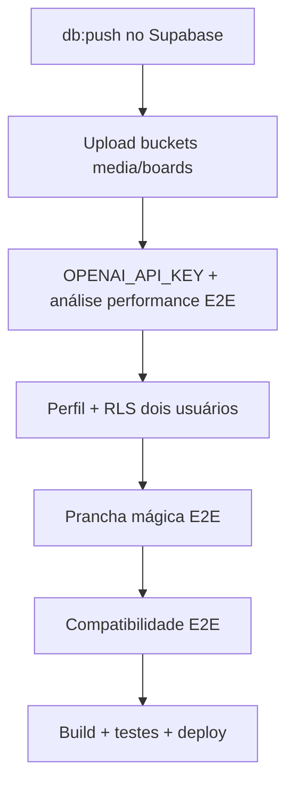

# Pendências — Surf Performance & Board AI

> Consolidado a partir do checklist de [implementação 03/07/2026](../implementation/2026-07-03-fundacao-mvp-inicial.md).  
> **Status:** código MVP scaffolded; validação de ambiente, IA e deploy pendente.

---

## 🔴 Prioridade imediata (próxima sessão)

Itens bloqueadores para os fluxos principais funcionarem de ponta a ponta.

- [ ] Confirmar `npm run db:push` no projeto Supabase remoto (5 migrations: profiles, media/analyses, boards, storage policies, buckets)
- [ ] Configurar `OPENAI_API_KEY` em `.env.local` e testar uma análise de performance completa
- [ ] Testar upload de mídia e fotos de prancha nos buckets privados (`media`, `boards`)
- [ ] Validar edição de perfil e persistência dos dados
- [ ] Validar isolamento RLS entre dois usuários distintos

---

## 🟡 Fase 0 — Fundação técnica

Critérios de saída ainda não validados:

- [ ] `npm run build` validado localmente com env de produção
- [ ] Deploy (Vercel + Supabase prod)

---

## 🟡 Fase 1 — Autenticação e perfil (P0)

Critérios de saída ainda não validados:

- [ ] Edição de perfil validada E2E (persistência confirmada)
- [ ] RLS testado com dois usuários distintos *(também em prioridade imediata)*
- [ ] Checklist `SECURITY.md` §A07 revisado formalmente

---

## 🟡 Fase 2 — Análise de performance (P0)

Critérios de saída ainda não validados:

- [ ] Upload de vídeo/imagem testado com bucket `media` no Supabase remoto
- [ ] Análise IA completa com `OPENAI_API_KEY` configurada *(também em prioridade imediata)*
- [ ] Link malicioso rejeitado em fluxo real (não só unit test)

---

## 🟡 Fase 3 — Prancha mágica (P0)

Critérios de saída ainda não validados:

- [ ] `npm run db:push` aplicado no projeto Supabase remoto *(também em prioridade imediata)*
- [ ] Upload de ≥3 fotos testado no bucket `boards`
- [ ] Ficha técnica gerada e persistida com IA real
- [ ] Resumo “por que funciona para você” validado com perfil completo

---

## 🟡 Fase 4 — Compatibilidade de prancha (P1)

Critérios de saída ainda não validados:

- [ ] Análise de compatibilidade testada E2E com IA
- [ ] Veredito, prós, contras e condições ideais validados na UI

---

## 🟢 Fase 5 — Polish e lançamento

- [ ] Cobertura de testes ≥80% em services/parsers
- [ ] Expandir suite de testes (parsers de board-spec e board-match)
- [ ] Empty states e onboarding revisados em mobile
- [ ] Observabilidade (logs sem PII)
- [ ] Deploy produção (Vercel) *(também em Fase 0)*
- [ ] Checklist final `SECURITY.md` + Design System §15

---

## Ordem sugerida de execução

1. **Infra:** `db:push` → buckets e policies ativos
2. **IA:** chave OpenAI → análise de performance end-to-end
3. **Auth/dados:** perfil + RLS
4. **Módulos:** prancha mágica → compatibilidade
5. **Qualidade:** testes, build, security/design checklist, deploy

---

## Referências

- [Implementação 03/07/2026](../implementation/2026-07-03-fundacao-mvp-inicial.md)
- [Plano de Execução](../PLANO_EXECUCAO.md)
- [Segurança](../SECURITY.md)
