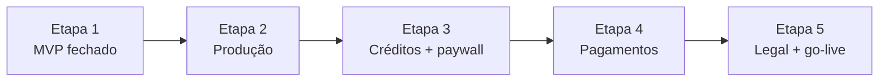

# Pendências — Surf Performance & Board AI

> **Objetivo:** fechar MVP funcional → deploy produção → monetização SaaS → lançamento comercial.  
> **Status atual:** MVP funcional homologado (26/26 TCs) · Produção live no domínio `surfiacoach.modernxlab.com.br` · Billing Mercado Pago **homologado e validado em produção com compra real** (12/09/2026).  
> **Última revisão:** 14/09/2026 — Análise da onda completa (vídeo) no código; pintura da foto desligada após homologação do owner. Billing Mercado Pago validado em produção (12/09).

---

## Visão geral

| Marco | Situação | Homologação |
|-------|----------|-------------|
| Auth + perfil | ✅ Código + E2E | FL-01 (7/7) · FL-02 (3/3) · SMTP próprio validado |
| Análise performance | ✅ Código + E2E · frames-only · onda em fases (código) | FL-03 (6/6) · gabarito 14/09 pendente |
| Prancha mágica | ✅ Código + E2E | FL-04 (4/4) |
| Compatibilidade | ✅ Código + E2E · gate UX mágica | FL-05 (2/2) |
| Segurança RLS | ✅ Validado | FL-06 (2/2) |
| Shell / mobile | ✅ Validado | FL-07 (2/2) |
| Especialização IA performance | 🟡 Fase A implementada, validação pendente | — |
| Monetização | ✅ Créditos + paywall (Trilha A) | 12/12 concluído |
| Pagamentos | ✅ Mercado Pago live (Trilha H) | Homologado com compra real em 12/09 |
| Deploy produção | ✅ Live (`surfiacoach.modernxlab.com.br`) | HTTPS + SMTP + Vercel Gru1 |
| Legal (LGPD / Termos) | ✅ Concluído (Trilha C) | Termos, Privacidade, Reembolso |

**Total homologação:** 26/26 TCs aprovados (100%).

---

## Iniciativa — Análise de vídeo por frames (sem MP4) 🟡

> Spec: [`specs/2026-09-02-analise-video-frames-sem-armazenar-original.md`](../../specs/2026-09-02-analise-video-frames-sem-armazenar-original.md) · Manual: [`docs/manual-dev/09-fase-analise-video-frames.md`](../manual-dev/09-fase-analise-video-frames.md)

**Código implementado (02/09/2026):**

- [x] Migration `013_media_frame_paths.sql` (`frame_paths`)
- [x] Fluxo de vídeo sem upload do original; só JPEGs no bucket `media`
- [x] Limites no aparelho: 500 MB · 90 s + copy do dropzone
- [x] Miniaturas na tela da análise
- [x] Reanálise via `frame_paths`; legado com mensagem clara
- [x] Exclusão de conta remove `frame_paths`
- [x] Testes de limites / paths / legado · typecheck · lint · test verdes

**Pendente:**

- [ ] `db:push` migration **013** (confirmação do owner)
- [ ] Homologação manual: vídeo > 50 MB; conferir bucket sem MP4; reanálise nova/legado; exclusão

---

## Iniciativa — Análise da onda completa (vídeo) 🟡

> Spec: [`specs/2026-09-14-analise-onda-completa.md`](../../specs/2026-09-14-analise-onda-completa.md) · Manual: [`docs/manual-dev/11-fase-analise-onda-completa.md`](../manual-dev/11-fase-analise-onda-completa.md) · Implementação: [`docs/implementation/2026-09-14-analise-onda-completa.md`](../implementation/2026-09-14-analise-onda-completa.md)

**Código implementado (14/09/2026):**

- [x] Extração até **8** fotos da session; mobile ainda aceita **≥ 2**
- [x] Contrato `fases[]` + `leitura_da_secao` (parser Zod; legado sem fases continua válido)
- [x] Prompt de vídeo: onda inteira, drop relativo, não elogiar manobra falhada, dica concreta
- [x] Timeline na UI com foto da evidência, qualidade e certeza da identificação rotulada
- [x] Coaching visual **desligado** (owner 14/09): `WAVE_COACHING_VISUAL_ENABLED = false`; timeline fica na foto original
- [x] Exclusão de conta remove frames **e** paths de coaching (legado)
- [x] Testes da feature · typecheck · lint · test verdes

**Pendente (homologação — não código extra):**

- [ ] Gabarito point lento: drop não cobra agressividade irreal
- [ ] Gabarito beach break: batida errada = falhou/regular, não “bem executada”
- [ ] 2ª manobra abortada = leitura de seção
- [ ] Timeline cobre drop, bottom turn e manobras visíveis

---

## Iniciativa paralela — Especialização da IA de performance 🟡

> Track independente das etapas de lançamento abaixo — foco em reduzir erros de nomenclatura de manobra e generalização nos pontos de melhoria. Referência completa: [Plano de especialização IA](../implementation/2026-07-17-plano-especializacao-ia-performance.md).

### Fase A — Quick wins de prompt e frames

**Código implementado (17/07/2026):**

- [x] Taxonomia fechada de 11 manobras com critério visual objetivo (`lib/ai/performance-prompt.ts`)
- [x] Campo `confianca_manobra` (alta/media/baixa) no prompt, parser Zod e tipos de domínio
- [x] Regra para citar timestamp do frame em pelo menos 1 ponto de melhoria (vídeo)
- [x] Extração de frames de 3 → 6, distribuição uniforme via função pura (`lib/media/video-frame-sampling.ts`), aplicada no extrator server (`extract-video-frames.ts`) e client (`extract-video-frames-browser.ts`)
- [x] Validação do novo número de frames no server action (`actions/analysis-actions.ts`)
- [x] Badge de confiança da manobra na UI (`performance-result-view.tsx`)
- [x] `VISION_MODEL` testado com `gpt-4o` e **revertido para `gpt-4o-mini`** (17/07/2026) — validar primeiro o ganho da taxonomia/confiança/mais frames antes de pagar ~17x mais por `gpt-4o`
- [x] Testes novos/atualizados: `video-frame-sampling.test.ts` (5 testes) + 2 casos em `security-and-parsers.test.ts` — suíte completa 43/43 ok
- [x] `lint`, `typecheck` e `build` de produção validados sem regressão

**Pendente:**

- [ ] **Validação manual com mídia real** — usuário testando agora (17/07/2026) com `OPENAI_API_KEY` real, comparando erro de nomenclatura antes/depois, usando `gpt-4o-mini` + taxonomia/confiança/6 frames
- [ ] Se `gpt-4o-mini` ainda errar manobra com frequência, reavaliar `gpt-4o` (ou eval set da Fase B) com dados concretos em mãos

### Próximas fases (não iniciadas)

- [ ] **Fase B** — eval set de qualidade (gabarito de 20–30 casos reais validados por coach/surfista experiente)
- [ ] **Fase C** — captura de correções humanas por análise (nova tabela `analysis_corrections` + UI de correção)
- [ ] **Fase D** — RAG/few-shot com exemplos validados injetados no prompt
- [ ] **Fase E** — fine-tuning de modelo customizado (opcional, longo prazo, só com dataset maduro)

---

## Plano de execução — Lançamento SaaS


```mermaid
flowchart LR
  E1[Etapa 1<br/>MVP fechado] --> E2[Etapa 2<br/>Produção]
  E2 --> E3[Etapa 3<br/>Créditos + paywall]
  E3 --> E4[Etapa 4<br/>Pagamentos]
  E4 --> E5[Etapa 5<br/>Legal + go-live]
```

| Etapa | Foco | Estimativa | Critério de saída |
|-------|------|------------|-------------------|
| **1** | MVP funcional fechado | ~1 semana | 26/26 TCs · RLS validado |
| **2** | Infra produção | ~2–3 dias | URL pública · env prod · rate limit persistente |
| **3** | Monetização mínima | ~1 semana | Créditos free · paywall · ledger |
| **4** | Pagamentos | ~1–2 semanas | Stripe/MP · planos · webhooks |
| **5** | Legal + lançamento | ~3–5 dias | Termos · privacidade · beta pago |

---

## Etapa 1 — MVP funcional fechado 🟡

> **Quase concluída.** E2E 100% + segurança revisada + IA visão board-match. Falta apenas validação visual formal DoD.

### 1.1 Validação E2E ✅ *(26/26 TCs — 13/07/2026)*

- [x] **TC-19** — Compatibilidade com prancha mágica de referência (`/compatibility/new` → IA → `/compatibility/[id]`) *(13/07/2026)*
- [x] **TC-20** — Veredito, prós, contras e condições ideais na UI *(13/07/2026 — IA visão nas fotos candidatas validada E2E)*
- [x] **TC-21** — Isolamento RLS: usuário A não vê análises/pranchas/perfil de usuário B *(13/07/2026 — Ivan Martins vs Ivan Barbosa; dashboard e métricas isolados)*
- [x] **TC-22** — Storage: arquivos no bucket acessíveis só pelo dono (policy RLS) *(13/07/2026 — isolamento confirmado com duas contas)*
- [x] **TC-23** — Dashboard com CTAs para análises, pranchas e compatibilidade *(13/07/2026 — CTAs validados E2E)*
- [x] **TC-24** — Navegação mobile (viewport ≤390px, alvos ≥44px, sem overflow) *(13/07/2026)*

### 1.2 Perfil e segurança ✅ *(13/07/2026)*

- [x] Edição de perfil validada E2E *(TC-06/07/08, 07/07/2026)*
- [x] Revalidar perfil após mudanças recentes — sem regressão observada *(13/07/2026)*
- [x] Checklist `SECURITY.md` §A07 (auth) revisado formalmente → [SECURITY_REVIEW-2026-07-13.md](./SECURITY_REVIEW-2026-07-13.md)
- [x] Checklist `SECURITY.md` §A10 (SSRF links) — TC-12 ✅ + testes unitários + revisão formal

### 1.3 Qualidade mínima pré-deploy

- [x] Expandir testes: parsers `board-spec` e `board-match` (`lib/__tests__/board-spec-parsers.test.ts`)
- [x] **IA visão** nas fotos candidatas do board-match (`chatJsonCompletionWithVision`) — **validado E2E 13/07/2026**
- [x] Testes auxiliares: prompts board-match, rate-limit, security/parsers *(35 testes Vitest)*
- [x] Empty states revisados em mobile — header `/analyses` com `gap-4` + `shrink-0` no CTA
- [ ] Checklist Design System §15 (DoD visual) — revisão formal pendente *(TC-24 cobre mobile/nav)*

**Critério de saída Etapa 1:** 26/26 TCs ✅ · 0 bugs bloqueadores ✅ · security checklist OK ✅ · DoD visual §15 pendente.

---

## Etapa 2 — Infraestrutura de produção 🟡

> **2.1 concluída (14/07/2026).** App em URL pública na Vercel · auth e IA validados em prod. **2.2 concluída (14/07/2026)** — rate limit Postgres + Sentry. Próximo: 2.3 landing.

### 2.1 Deploy ✅ *(14/07/2026)*

- [x] Projeto Vercel criado e conectado ao repositório *(14/07/2026)*
- [x] Variáveis de ambiente de produção configuradas (Supabase, OpenAI, `NEXT_PUBLIC_SITE_URL`) *(14/07/2026)*
- [x] Supabase prod: redirect URLs (`/auth/callback`) + Site URL *(14/07/2026)*
- [x] `npm run db:push` confirmado no projeto Supabase de produção (6 migrations incl. feedback) *(14/07/2026)*
- [x] Smoke test pós-deploy: signup → análise → prancha mágica *(14/07/2026)*
- [x] `vercel.json` (região gru1) + `maxDuration` 60s + timeout IA ajustado para Vercel
- [x] Guia de deploy documentado → [DEPLOY_VERCEL.md](../DEPLOY_VERCEL.md)

> **URL atual:** `*.vercel.app` — suficiente para beta fechado. Domínio e SMTP customizado ficam em [2.4](#24-aguardando-domínio-prprio-).

### 2.2 Rate limit e observabilidade ✅ *(14/07/2026)*

- [x] Migrar `rateLimitAiAction` de `Map` in-memory para Postgres (`007_rate_limit.sql` + RPC `check_rate_limit`)
- [x] Rate limit auth persistido (mesma abordagem — bucket `auth:{email}`)
- [x] Observabilidade: Sentry (`@sentry/nextjs`, scrub PII, tags `area:ai|upload|rate-limit`)
- [x] Alertas básicos documentados: CI (GitHub Actions), Sentry (issues IA/upload), OpenAI usage manual

### 2.3 Landing e comunicação

- [ ] Landing `/` com features, prova social e CTA (sem prometer “ilimitado”)
- [ ] Página `/planos` (placeholder com planos previstos — pode ser “em breve” no beta)

### 2.4 Aguardando domínio próprio ⏸️

> **Pendente — bloqueado até registrar domínio.** Não impede Etapas 2.2, 2.3 nem 3. Retomar antes de lançamento público ou cobrança (Etapas 4–5).

- [ ] Registrar domínio (ex.: `surfcoach.com.br`, `surfboardai.app`)
- [ ] Vercel → **Settings → Domains** — adicionar domínio e configurar DNS (CNAME/A)
- [ ] Atualizar `NEXT_PUBLIC_SITE_URL` com a URL final → redeploy
- [ ] Supabase Auth → **Site URL** + **Redirect URLs** (`https://seudominio/auth/callback`)
- [ ] SMTP customizado (Resend, SendGrid, etc.) — remetente `@seudominio` · Supabase → Auth → SMTP

**Enquanto isso:** auth e e-mails seguem pelo Supabase padrão na URL `.vercel.app` ✅

**Critério de saída Etapa 2:** app acessível em URL pública · auth e IA funcionando em prod · rate limit persistente.

---

## Etapa 3 — Monetização mínima (Fase A) 🟡

> Referência: [PLANOS_E_LIMITES.md](../PLANOS_E_LIMITES.md) — Fase A.

### 3.1 Schema e migrations

- [ ] Migration: colunas em `profiles` — `plan`, `credits_balance`, `credits_period_used`, `billing_period_start`
- [ ] Migration: tabela `usage_ledger` (user_id, analysis_id, analysis_type, credits_delta, reason, created_at)
- [ ] RLS em `usage_ledger` — usuário só lê próprios registros

### 3.2 Service e integração

- [ ] `services/usage-service.ts` — `getRemainingCredits`, `debitCredit`, `canStartAnalysis`, `refundCredit`
- [ ] Débito atômico: crédito + criação de análise na mesma transação lógica
- [ ] Integrar em `analysis-service`, `board-service`, `board-match-service` (substituir só rate limit como gate comercial)
- [ ] Manter `rateLimitAiAction` como teto anti-abuso (20/dia) além da cota do plano
- [ ] Plano free: **2 créditos** no primeiro ciclo (conforme PLANOS_E_LIMITES)
- [ ] Retry por erro de sistema: **não debita** crédito

### 3.3 UI

- [ ] Contador “X créditos restantes” no dashboard e antes do upload
- [ ] Paywall ao esgotar créditos (upgrade ou pack — CTA mesmo antes do gateway)
- [ ] CTA pós-primeira análise bem-sucedida (momento de maior valor percebido)

**Critério de saída Etapa 3:** usuário free consome 2 créditos e vê paywall · ledger auditable · sem cobrança real ainda.

---

## Etapa 4 — Pagamentos (Mercado Pago) 🟡

> Spec: [`specs/2026-09-02-billing-mercadopago.md`](../../specs/2026-09-02-billing-mercadopago.md) · Manual: [`docs/manual-dev/08-fase-billing-mercadopago.md`](../manual-dev/08-fase-billing-mercadopago.md)  
> Histórico AbacatePay: [`specs/2026-08-20-billing-abacatepay.md`](../../specs/2026-08-20-billing-abacatepay.md)

### 4.1 Gateway e código

- [x] Provedor: **Mercado Pago** (substitui AbacatePay — cartão descontinuado para contas novas)
- [x] Migration `011_billing_abacatepay.sql`: tabelas/RPCs de billing
- [x] Migration `012_billing_mercadopago.sql`: provider `mercadopago` + default
- [x] Checkout assinatura Surfista/Pro (PreApproval) + packs S/M (Checkout Pro)
- [x] Webhooks MP: `payment`, `subscription_preapproval`, `subscription_authorized_payment` + HMAC
- [x] Página `/planos` com CTAs · `/billing` com cancelamento
- [x] Testes unitários (catalog, HMAC, service, idempotência, valor)
- [x] `/api/webhooks/abacatepay` → 410
- [ ] `npm run db:push` migration **012** em prod/staging
- [ ] Vercel: `MP_ACCESS_TOKEN` (`TEST-` primeiro) + `MP_WEBHOOK_SECRET`
- [ ] Homologação E2E sandbox (comprador de teste + cartão de teste)

### 4.2 Operação

- [x] Reset de ciclo na renovação webhook (cron mensal = follow-up)
- [ ] Política de estorno automático (não implementada)
- [x] Medir custo médio por análise (baseline Trilha G)
- [ ] Recalibrar preços se margem < alvo

**Critério de saída Etapa 4:** upgrade real funciona · webhook sincroniza plano · cancelamento respeitado · **homologação manual OK**.

---

## Etapa 5 — Legal, compliance e go-live 🟢

### 5.1 Documentos legais

- [ ] Termos de Uso (fair use, limites de créditos, uso pessoal)
- [ ] Política de Privacidade (LGPD — vídeos, perfil, feedback, retenção)
- [ ] Política de reembolso
- [ ] Links no footer (landing + app autenticado)

### 5.2 Go-live comercial

- [ ] Beta fechado: 10–20 usuários reais (surfistas)
- [ ] Formulário de feedback já existe — monitorar `/admin/feedback`
- [ ] Métricas MVP: ≥1 análise performance · ≥1 prancha mágica · retorno 2+ análises
- [ ] Anunciar lançamento público

**Critério de saída Etapa 5:** cobrança ativa · documentos legais publicados · primeiros pagantes.

---

## Concluído ✅

> Itens das fases anteriores já entregues. Não reabrir salvo regressão.

### Infra e fundação

- [x] `npm run db:push` no Supabase remoto (migrations 001–005)
- [x] `npm run build` validado localmente com env de produção
- [x] CI GitHub Actions (lint, typecheck, test, build)
- [x] Headers de segurança em `next.config.ts`

### Auth e perfil (FL-01 · FL-02)

- [x] Signup, login, logout, recuperação de senha
- [x] **Signup UX Fase A** — redirect pós-cadastro, banners login, callback confirmação ([implementation](../implementation/2026-08-21-signup-ux-fluxo-conta.md))
- [ ] **Signup UX homologação manual** — criar conta → banner login → confirmar e-mail → login → dashboard
- [x] Rotas protegidas e redirect pós-logout (TC-25, TC-26)
- [x] Edição de perfil E2E (TC-06, TC-07, TC-08)

### Análise de performance (FL-03)

- [x] `OPENAI_API_KEY` configurada
- [x] Link YouTube + IA (TC-09)
- [x] Upload imagem + IA visão (TC-10)
- [x] Upload vídeo + frames (TC-11)
- [x] Link malicioso rejeitado (TC-12)
- [x] Detalhe e listagem com score/preview (TC-13, TC-14)

### Prancha mágica (FL-04)

- [x] Upload ≥3 fotos bucket `boards` (TC-15)
- [x] Ficha técnica IA persistida (TC-16)
- [x] Resumo “por que funciona para você” (TC-17)
- [x] Detalhe `/boards/[id]` e listagem (TC-18)

### Compatibilidade (FL-05)

- [x] Análise E2E com prancha mágica de referência (TC-19, 13/07/2026)
- [x] Veredito, prós, contras e condições ideais na UI (TC-20, 13/07/2026)
- [x] Histórico em `/compatibility` + rotas de detalhe *(13/07/2026)*
- [x] **Match depende de prancha mágica (gate UX)** — nav sem Match irmão; hub/detalhe/dashboard; referência obrigatória no form novo; histórico legado preservado; backend sem bloqueio *(código 10/09/2026)* · Spec [`2026-09-10-match-depende-prancha-magica`](../../specs/2026-09-10-match-depende-prancha-magica.md)
- [ ] Homologação manual do gate UX (sem mágica / só draft / ready / deep link / legado)

---

## Ordem de trabalho (agora)

> **Plano operacional com trilhas paralelas e scoreboard Done:**  
> → **[PLANO_GO_LIVE_COBRANCA.md](./PLANO_GO_LIVE_COBRANCA.md)** ← use este doc para marcar tarefas.

```
Paralelo agora:  A créditos · B landing · C legal · D gateway · E domínio · F qualidade · G custo
Depois:          H pagamentos (código)  →  I go-live comercial
```

**Sessão atual sugerida:** `db:push` migration **012** + env MP na Vercel + homologação sandbox (comprador/cartão de teste).

---

## Referências

- [Plano Go-Live + Cobrança](./PLANO_GO_LIVE_COBRANCA.md) — **checklist operacional A–I (Done)**
- [Plano de Execução](../PLANO_EXECUCAO.md) — fases 0–5 originais
- [Planos e Limites](../PLANOS_E_LIMITES.md) — créditos, preços, schema SaaS
- [Segurança](../SECURITY.md) — checklist DoD
- [Deploy Vercel](../DEPLOY_VERCEL.md) — guia de publicação
- [Revisão segurança 13/07/2026](./SECURITY_REVIEW-2026-07-13.md) — §A07 auth + §A10 SSRF
- [Relatório de testes manuais](../relatorio-testes-manuais.html) — POP-QA-SURF-001
- [Implementação 03/07/2026](../implementation/2026-07-03-fundacao-mvp-inicial.md)
