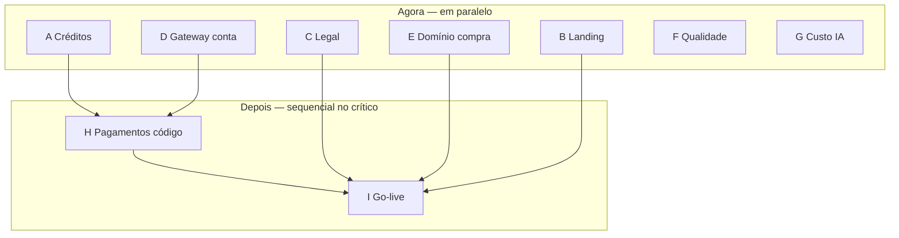

# Plano Go-Live + Cobrança — Surf Performance & Board AI

> **Objetivo:** colocar o SaaS no ar cobrando (créditos → gateway → legal → beta pago).  
> **Como usar:** marque `[x]` ao concluir; atualize o scoreboard e a data de revisão.  
> **Referências:** [PENDENCIAS.md](./PENDENCIAS.md) · [PLANOS_E_LIMITES.md](../PLANOS_E_LIMITES.md) · [DEPLOY_VERCEL.md](../DEPLOY_VERCEL.md)

**Criado:** 10/08/2026 · **Última revisão:** 10/08/2026 (Trilha G) · **Owner:** time Surf AI Coach

---

## Scoreboard

| Trilha | Nome | Status | Done / Total |
|--------|------|--------|--------------|
| A | Créditos + paywall (caminho crítico) | 🟢 Concluído | 12 / 12 |
| B | Landing + comunicação | 🔴 Não iniciado | 0 / 5 |
| C | Legal / LGPD | 🟢 Concluído | 5 / 5 |
| D | Gateway (decisão + conta) | 🔴 Não iniciado | 0 / 4 |
| E | Domínio + SMTP | ⏸️ Aguardando domínio | 0 / 5 |
| F | Qualidade / DoD / IA | 🟡 Em andamento | 0 / 4 |
| G | Custo IA + operação | 🟢 Concluído | 3 / 3 |
| H | Pagamentos (código) | ⏸️ Depende de A + D | 0 / 10 |
| I | Go-live comercial | ⏸️ Depende de A–H | 0 / 5 |

**Legenda de status:** 🔴 Não iniciado · 🟡 Em andamento · 🟢 Concluído · ⏸️ Bloqueado / aguardando

**Progresso geral:** 20 / 53 tarefas

---

## Convenção

- `[ ]` pendente · `[x]` concluído
- Ao concluir uma trilha: status → 🟢 e atualizar `Done / Total` no scoreboard
- Critério de **Done** de cada trilha está no final da seção
- Itens com ⚡ podem rodar **em paralelo** com outras trilhas abertas
- Itens com 🔒 só começam após a dependência listada

---

## Visão de paralelismo

| Pode começar agora (paralelo) | Espera outra trilha |
|-------------------------------|---------------------|
| A, B, C, D, E (compra), F, G | H ← A + D · I ← H + C (+ E recomendado) |

---

## Trilha A — Créditos + paywall ⚡

> Caminho crítico de produto. Ref.: [PLANOS_E_LIMITES.md](../PLANOS_E_LIMITES.md) Fase A · Etapa 3 em PENDENCIAS.

### A.1 Schema

- [x] Migration: `profiles` com `plan`, `credits_balance`, `credits_period_used`, `billing_period_start`
- [x] Migration: tabela `usage_ledger` (user_id, analysis_id, analysis_type, credits_delta, reason, created_at)
- [x] RLS em `usage_ledger` — usuário só lê os próprios registros
- [x] `npm run db:push` no Supabase de produção

### A.2 Service

- [x] `services/usage-service.ts` — `getRemainingCredits`, `debitCredit`, `canStartAnalysis` (+ reserve/release)
- [x] Débito atômico com criação/sucesso da análise (retry de erro de sistema **não** debita)
- [x] Integrar gate em `analysis-service`, `board-service`, `board-match-service`
- [x] Manter `rateLimitAiAction` (20/dia) como teto anti-abuso além da cota
- [x] Plano free: **2 créditos** no total para novos signups
- [x] Testes unitários do `usage-service` / domínio de créditos

### A.3 UI

- [x] Contador “X créditos restantes” no dashboard e antes do upload/análise
- [x] Paywall ao esgotar (CTA → `/planos` de exemplo)
- [x] Badge no shell + confirmação de reanálise voluntária

**Done da trilha A:** usuário free consome 2 créditos → vê paywall → ledger auditável em prod · sem cobrança real.  
**Nota 10/08/2026:** `008_credits_usage.sql` aplicada em produção via `npm run db:push`.

---

## Trilha B — Landing + comunicação ⚡

> Pode rodar em paralelo com A. Checkout real fica na H.

- [ ] Landing `/` com features, prova social e CTA (sem prometer “ilimitado”)
- [ ] Página `/planos` placeholder com preços previstos (Surfista / Pro / packs)
- [ ] Copy alinhada a créditos/mês (não “vídeos ilimitados”)
- [ ] Links para Termos/Privacidade no footer (podem apontar para “em breve” até C fechar)
- [ ] Smoke visual mobile + desktop da landing e `/planos`

**Done da trilha B:** visitante entende o produto e os planos; CTAs claros para signup/upgrade.

---

## Trilha C — Legal / LGPD ⚡

> Paralelo total com código. Ideal fechar antes do go-live (I).

- [x] Termos de Uso (fair use, limites de créditos, uso pessoal, responsabilidade da IA)
- [x] Política de Privacidade LGPD (vídeos, perfil, feedback, retenção, bases legais)
- [x] Política de reembolso
- [x] Publicar páginas no app (ex.: `/termos`, `/privacidade`, `/reembolso`)
- [x] Links no footer (landing + shell autenticado)

**Done da trilha C:** três documentos publicados e linkados; revisados por responsável (advogado ou owner).  
**Nota 10/08/2026:** páginas + aceite signup + cookies essenciais + export/exclusão no perfil; placeholders do controlador; reembolso genérico até Trilha H. Texto legal aprovado pelo owner (Ivan).

---

## Trilha D — Gateway (decisão + conta) ⚡

> Decisão de negócio. Não precisa esperar código da A para abrir conta.

- [ ] Decidir provedor: **Stripe** ou **Mercado Pago**
- [ ] Conta criada e verificada (dados fiscais / KYC)
- [ ] Produtos/preços rascunhados: Surfista R$ 39 (8) · Pro R$ 89 (30) · Pack S R$ 19 (5) · Pack M R$ 49 (15)
- [ ] Webhooks de teste documentados (URL staging / secrets no `.env` — sem commitar)

**Done da trilha D:** provedor escolhido, conta ativa, preços criados no painel, secrets prontos para a H.

---

## Trilha E — Domínio + SMTP ⚡ / ⏸️

> ⚡ Comprar domínio agora. ⏸️ DNS/SMTP após registro. Não bloqueia A–D; recomendado antes de I.

- [ ] Registrar domínio (ex.: `surfcoach.com.br` / `surfboardai.app`)
- [ ] Vercel → Domains + DNS (CNAME/A)
- [ ] Atualizar `NEXT_PUBLIC_SITE_URL` → redeploy
- [ ] Supabase Auth: Site URL + Redirect URLs (`https://dominio/auth/callback`)
- [ ] SMTP customizado (Resend/SendGrid) remetente `@dominio`

**Done da trilha E:** auth, e-mails e links de reset funcionam no domínio próprio.

---

## Trilha F — Qualidade / DoD / IA ⚡

> Paralelo; melhora conversão/retenção, não bloqueia A.

- [ ] Checklist Design System §15 (DoD visual) — revisão formal
- [ ] Validação manual da especialização IA performance com mídia real
- [ ] Decisão: manter `gpt-4o-mini` ou subir para `gpt-4o` com dados de erro
- [ ] Registrar evidências / conclusão em `docs/implementation/` ou fixed_tasks

**Done da trilha F:** DoD visual ok · decisão de modelo documentada · sem bugs bloqueadores conhecidos.

---

## Trilha G — Custo IA + operação ⚡

- [x] Medir custo médio por análise (performance / board / match) no billing OpenAI
- [x] Conferir margem vs preços (Surfista / Pro) — ver projeção em PLANOS_E_LIMITES
- [x] Alertas básicos: Sentry IA/upload + revisão semanal de usage OpenAI

**Done da trilha G:** custo/análise conhecido; preços validados ou ajustados antes de ads.  
**Nota 10/08/2026:** instrumentação `ai.usage` + baseline/margem Go em [docs/implementation/2026-08-10-custo-ia-operacao.md](../implementation/2026-08-10-custo-ia-operacao.md). Decisão: **manter preços**. Amostra mínima cruzada com OpenAI Billing fica como validação operacional do owner (§4 do doc). Alertas Sentry + rotina semanal documentados em `DEPLOY_VERCEL.md` §7.

---

## Trilha H — Pagamentos (código) 🔒

> **Depende de:** A (ledger/créditos) + D (provedor/conta).

### H.1 Integração

- [ ] Migration: tabela `subscriptions` (user_id, provider, external_id, status, plan, current_period_end) + RLS
- [ ] Checkout assinatura Surfista e Pro
- [ ] Checkout packs avulsos (S e M) → crédito em `usage_ledger`
- [ ] Webhooks: `active`, `past_due`, `canceled`, compra avulsa
- [ ] Sincronizar `profiles.plan` / créditos a partir do webhook
- [ ] Página `/planos` com CTAs de checkout reais
- [ ] Página `/billing` (ou seção no perfil): plano, renovação, cancelamento
- [ ] Testes de webhook (upgrade, falha, cancelamento) em ambiente de teste

### H.2 Operação

- [ ] Job mensal: reset `credits_period_used` no início do ciclo
- [ ] Checklist segurança: secrets só server-side · webhook assinado · Zod na entrada

**Done da trilha H:** pagamento teste → plano ativo → créditos creditados · cancelamento respeitado.

---

## Trilha I — Go-live comercial 🔒

> **Depende de:** H + C. **Recomendado:** E (domínio) + B (landing) + G (margem ok).

- [ ] Beta fechado: 10–20 surfistas reais
- [ ] Monitorar `/admin/feedback`
- [ ] Métricas MVP: ≥1 análise performance · ≥1 prancha mágica · retorno 2+ análises
- [ ] Cobrança real habilitada (modo live do gateway)
- [ ] Anunciar lançamento público

**Done da trilha I:** primeiros pagantes · docs legais no ar · app estável em domínio (ou URL acordada).

---

## Cronograma sugerido (paralelo)

| Semana | Trilhas em paralelo | Entrega esperada |
|--------|---------------------|------------------|
| **1** | A (schema+service) · B · C (rascunho) · D · E (compra) · F · G | Créditos no backend + landing placeholder + conta gateway |
| **2** | A (UI paywall) · C (publicar) · E (DNS/SMTP se domínio ok) · F | Paywall free 2 créditos em prod · legal publicado |
| **3** | H (checkout + webhooks) | Upgrade teste funcionando |
| **4** | H (polish billing) · I (beta pago) | Primeiros pagantes |

Ajuste o calendário; a ordem das **dependências** importa mais que as datas.

---

## Checklist rápido “podemos cobrar?”

Marque só quando for verdade:

- [ ] Visão IA em produção (já ok no MVP — revalidar se mudar modelo)
- [x] Custo médio por análise medido (trilha G)
- [ ] `usage_ledger` + débito atômico (trilha A)
- [ ] Paywall + página de planos (A + B/H)
- [x] Termos + privacidade + reembolso (trilha C)
- [ ] Webhook de pagamento testado (trilha H)
- [ ] Rate limit persistente em prod (já ok — Etapa 2.2)
- [ ] Domínio + SMTP (trilha E — recomendado para cobrança pública)

**Go / No-Go:** todos os itens acima `[x]` → liberar modo live do gateway.

---

## Log de atualizações

| Data | O quê |
|------|--------|
| 10/08/2026 | Plano criado com trilhas A–I e scoreboard |
| 10/08/2026 | Trilha A implementada no código (Spec `2026-08-10-creditos-paywall`) — aguarda db:push prod |
| 10/08/2026 | Trilha C implementada (Spec `2026-08-10-legal-lgpd`) — docs legais, footer, aceite, cookies, direitos LGPD |
| 10/08/2026 | Trilha G — custo IA: logs `ai.usage`, baseline/margem Go, rotina semanal (Spec `2026-08-10-custo-ia-operacao`) |

---

## Referências

- [PENDENCIAS.md](./PENDENCIAS.md) — checklist histórico por etapa
- [PLANOS_E_LIMITES.md](../PLANOS_E_LIMITES.md) — preços, créditos, schema
- [PLANO_EXECUCAO.md](../PLANO_EXECUCAO.md) — fases 0–5 originais
- [SECURITY.md](../SECURITY.md) — DoD segurança
- [DEPLOY_VERCEL.md](../DEPLOY_VERCEL.md) — deploy e env
- [DESIGN_SYSTEM.md](../DESIGN_SYSTEM.md) — §15 DoD visual
